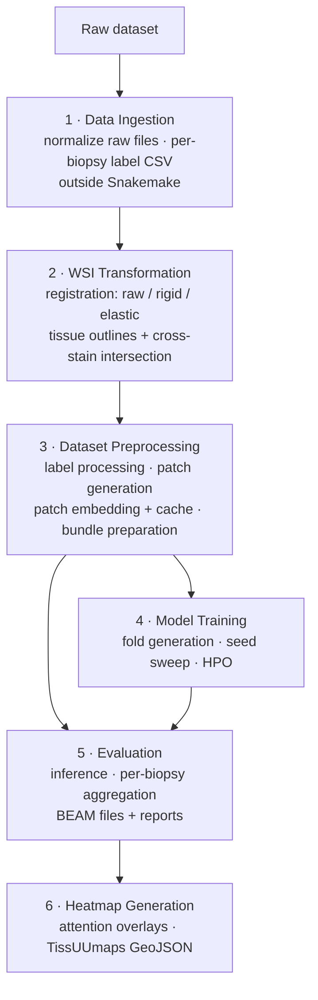

# Overview

## Purpose

A pipeline for preparing histology **whole-slide image (WSI)** datasets, generating patch embeddings, training **multiple-instance learning (MIL)** models, evaluating them, and producing reports and heatmaps.

The goal is **reproducible training and evaluation** across multiple datasets, stains, registration methods, patching strategies, embedding models, and label sources.

!!! tip "Terms & abbreviations"
    Project terms (cohort, bundle, bag, source variant, …) are introduced where they first appear; every term and abbreviation is also collected in the [Glossary](glossary.md).

## Why Snakemake

Snakemake drives most of the pipeline. It was chosen for:

- **SLURM integration** — stages run as cluster jobs.
- **DAG-based execution** — only the required outputs are (re)computed when inputs or configs change.

Stage 1 (Data Ingestion) sits *outside* Snakemake: each dataset needs its own bridge to reach the normalized format, so this part is user-written. Everything downstream is orchestrated by Snakemake.

*See the [Snakemake workflow](../impl/workflow.md) for every rule, its dependencies, and the config that drives it.*

---

## The six stages

Each stage produces explicit artifacts that can be validated, reused, and traced. **In most cases each stage runs individually**, but for simple evaluation runs they may be combined into a single invocation.

| Stage | Runs | Produces |
|---|---|---|
| 1 · Data Ingestion | Once per dataset (user-written) | Normalized scans + per-biopsy label CSV |
| 2 · WSI Transformation | Once per dataset | Raw / rigid / elastic variants + outlines |
| 3 · Dataset Preprocessing | Per patch/embedding config | Patches, embeddings, self-contained bundles |
| 4 · Model Training | Per experiment | Checkpoints, sweep results, HPO reports |
| 5 · Evaluation | Per evaluation run | **BEAM** files — the project's per-biopsy result format (per biopsy, per run) — + reports |
| 6 · Heatmap Generation | Per visual | Attention overlays (PNG) + TissUUmaps GeoJSON |

A **bundle** (produced in Stage 3) is the hand-off unit between preprocessing and the model stages. The same bundle can either train a new model or be evaluated against an existing one — including label-free bundles for external evaluation.

---

## Cross-cutting principle: training vs. heatmap roles

This is the single most important thing to understand about the design:

- **Training and all quantitative metrics use raw scans only.**
- **Registration (rigid / elastic) affects heatmap generation only**, never the reported numbers.

A raw-trained model is applied to registered images purely to produce aligned visuals. So patch-content distortion under elastic registration affects what a heatmap *looks* like but never what the model *scores*. See [WSI Transformation](04-wsi-transformation.md) for the full rationale.

---

## Scope

**In scope:** raw WSI ingestion, registration and outline detection, patch generation and embedding, bundle assembly, MIL model training (regression and classification families, with and without attention), seed sweeps, hyperparameter optimization (HPO), evaluation, aggregation, and heatmap generation.

**Out of scope (first version):** manual annotation tools, interactive web-based model inspection, automatic correction of incorrect metadata, and long-term storage infrastructure beyond the defined directory and bundle structure.

---

## Documentation map

- [Data Model](02-data-model.md) — entities, identifiers, bag naming, labels
- [Stage 1 · Data Ingestion](03-data-ingestion.md)
- [Stage 2 · WSI Transformation](04-wsi-transformation.md)
- [Stage 3 · Dataset Preprocessing](05-dataset-preprocessing.md)
- [Stage 4 · Model Training](06-model-training.md)
- [Stage 5 · Evaluation](07-evaluation.md)
- [Stage 6 · Heatmap Generation](08-heatmaps.md)
- [Configuration](10-configuration.md) — draft Snakemake configs
- [Open Questions & Decisions](09-open-questions.md)

Detailed file-format specs (BEAM, embeddings, outlines) live under [formats/](../formats/beam.md).
