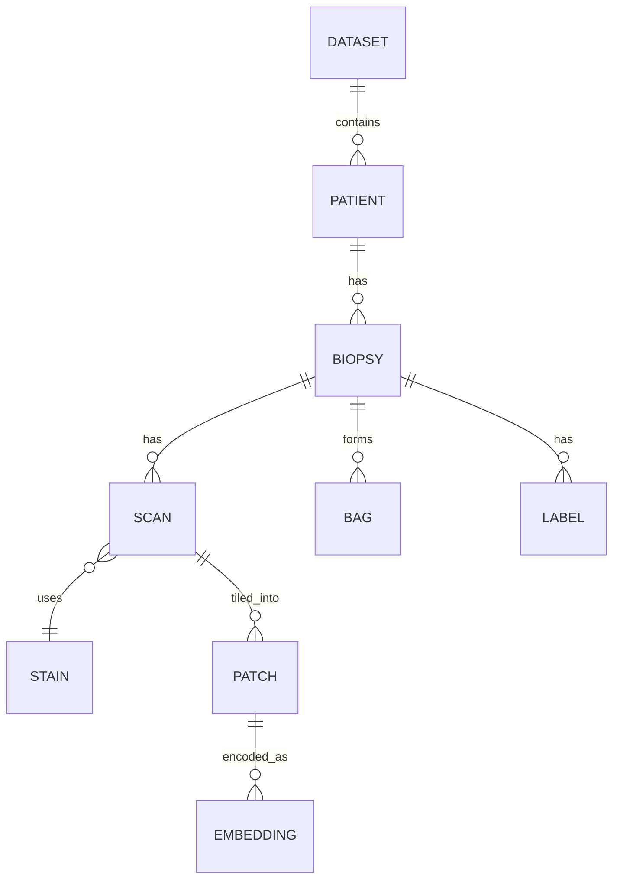

# Data Model

## Entity hierarchy



## Entity definitions

| Entity | Definition |
|---|---|
| **Dataset** | The patients, biopsies, scans, and labels from one **source**. The `dataset_id` names the source and may carry a version. |
| **Patient** | A biological individual, identified globally by `(dataset_id, patient_id)`. The unit splits are computed over. |
| **Cohort** | A named, possibly multi-dataset **group of patients**. Within a cohort each patient has a **role** (`development` / `holdout`). Splits and bundles derive from it; see [Cohorts, roles, and splits](#cohorts-roles-and-splits). |
| **Role** | A patient's place in a cohort: `development` (cross-validation) or `holdout` (locked test). |
| **Biopsy** | A tissue sample from one patient. The unit labels and bags are keyed on. |
| **Scan** | A digitized whole-slide image (WSI) from one biopsy and one stain. Any OpenSlide-supported format. |
| **Stain** | The staining method applied to a scan — H&E, or an immunohistochemistry (IHC) stain (Ki67, PSA). |
| **Patch** | A crop extracted from a scan at a configured size and resolution. |
| **Embedding** | A feature vector produced from a patch by an embedding model. |
| **Bag** | The set of patch embeddings used as one model input instance. |
| **Label** | A target value attached to a biopsy. Has a name, type, and value. Optional. |

---

## Cohorts, roles, and splits

Three levels, three vocabularies — so the word "test" is never overloaded.

**Cohort** — a named **group of patients** (may pool multiple dataset sources). The thing you reason about: "the prostate cohort."

**Role** — within a cohort, each patient is one of:

- **`development`** — used for model development; all cross-validation happens here.
- **`holdout`** — a small but important set locked away from all development, evaluated **once** at the end (aka "lockbox").

**Split** — *fold-level* assignments **among the development patients**, by the seed config: **`train`** / **`val`** / **`test`** per fold.

!!! tip "The rule that kills the ambiguity"
    `train` / `val` / `test` only ever describe **folds among development patients**. The reserved patients only ever have the **holdout** role — never called "test". So a **CV test score** (cross-validated, development) and a **holdout score** are unambiguous and clearly distinct.

### Bundles

A **bundle is a prepared cohort**: it materializes the cohort for one `(stain · embedding model · source variant · patch config)`, with **every** patient's bags present and tagged by `role`. **Role is a column in the bundle manifest, not a separate bundle** — one cohort → many bundles (per stain/embedding/etc.), each containing all roles.

Stages then pick a **subset** (an enum, never a list):

| `subset` | Used by | Meaning |
|---|---|---|
| `development` | Training (CV) | bags with role `development`; folds (train/val/test) assigned within |
| `holdout` | Evaluation | the locked patients; scored once |
| `all` | Final retrain | `development` ∪ `holdout`; only after holdout is consumed |

So "train on the union" is `subset: all` — a single value, **not** an assembled list. Because folds are assigned to *patients*, every stain/embedding bundle built from the same cohort inherits the **same fold split**.

### Leakage guarantees

- No patient appears in more than one of `train` / `val` / `test` within a fold (patient-level splitting).
- Holdout patients never appear in **any** fold of any development model.

---

## Source variants

A scan exists in up to three **source variants**, produced in [WSI Transformation](04-wsi-transformation.md):

- **`raw`** — original scan; misaligned across stains. **All training and metrics use this.**
- **`rigid`** — rotation/translation only; coarsely aligned, artifact-free.
- **`elastic`** — tightly aligned to H&E for overlays, at the cost of local tissue distortion.

The source variant is a first-class identifier component, not folded into the patching configuration, because it changes the pixel content patches are drawn from.

---

## Identifiers

All identifiers are stable and recorded in manifests, never inferred from filenames alone. `dataset_id` names the dataset **source** (optionally versioned), which is what lets a cohort pool patients from several sources — see the [appendix](12-appendix.md#how-dataset_id-is-meant-to-work).

| Identifier | Notes |
|---|---|
| `dataset_id` | Names the dataset **source**, optionally with a version (e.g. `sahlgrenska_2018`). Never `latest`. |
| `patient_id` | Unique within dataset. An **arbitrary index** (e.g. `p0001`) — **not** a real patient / PAD / scan number, to keep data de-identified |
| `biopsy_id` | Unique within patient |
| `scan_id` | **Derived** `{biopsy_id}__{stain}` — a scan is keyed by `(biopsy_id, stain)`, not a separately assigned id |
| `patch_config_id` | Patch size, resolution, overlap/stride |
| `source_variant` | `raw` / `rigid` / `elastic` |
| `embedding_model_id` | Model name + version |
| `cohort_id` | Named cohort (e.g. `prostate_combined_v1`) |
| `role` | `development` / `holdout` — a per-patient tag, not an id |
| `bundle_id` | `{cohort_id}__s{stains}__patch-{patch_config_id}__src-{source_variant}__emb-{embedding_model_id}` |
| `model_experiment_id` | Umbrella grouping name; groups runs across bundles (e.g. `ki67_stain_comparison`) |
| `run_id` | One run within a model experiment; carries tags |
| `bag_id` | Fully qualified — see below |

### Identifier grains

Each id names a different **grain** — which is why several coexist rather than being redundant:

| Id | Grain | What is keyed on it |
|---|---|---|
| `patient_id` | a person | folds / splits (patient-level) |
| `biopsy_id` | one tissue core | **labels**; bags roll up to it |
| `scan_id` = `{biopsy_id}__{stain}` | one **WSI** (biopsy × stain) | registration, outline, axis, **coords, embeddings**, QC PNG |
| `bag_id` | scan **× processing** | one model input = scan + patch_config + source_variant + embedding_model |
| `bundle_id` | a prepared cohort | a cohort × stain × embedding × variant |

`scan_id` is the per-image unit (everything computed from a single slide); it is *derived* from `(biopsy_id, stain)`, not separately assigned.

!!! note "Scope of short ids"
    `biopsy_id` (and therefore `scan_id`) is unique only **within a patient**. Scan-level artifact paths are namespaced by `dataset/patient` (e.g. `processed/{dataset}/{patient}/…`), and joins use the full `(dataset_id, patient_id, biopsy_id)` key. `bag_id` and `bundle_id` are fully qualified and globally unique on their own.

### Bag naming

A bag is identified by dataset origin, patient, biopsy, stain, patching configuration, source variant, and embedding model:

```
bag_id = {dataset_id}__p{patient}__b{biopsy}__s{stain}__patch-{patch_config_id}__src-{source_variant}__emb-{embedding_model_id}
```

Source variant is kept as its own field so that raw / rigid / elastic bags for the same biopsy are distinct and traceable.

---

## Storage formats

Binary is the source of truth; GeoJSON is the view. Anything meant for interactive inspection in TissUUmaps is also exported as GeoJSON, but the pipeline never depends on the GeoJSON for computation.

Detailed layouts live in the [format specs](../formats/beam.md); this is the overview.

| Artifact | Format | Spec |
|---|---|---|
| Scan manifest (input) | **YAML / JSON** (hierarchical, per-level metadata) | [Data Ingestion](../spec/data-ingestion.md) |
| Generated row manifests (bags, folds) | CSV / Parquet | — |
| Embeddings | **HDF5** (binary, per scan) | [Embeddings & patches](../formats/embeddings-and-patches.md) |
| Patch coordinates | **HDF5** (binary arrays) | [Embeddings & patches](../formats/embeddings-and-patches.md) |
| Tissue outlines | **Polygon arrays** (+ GeoJSON export) | [Outlines](../formats/outlines.md) |
| Patch / tissue geometry for viewing | **GeoJSON** | [Outlines](../formats/outlines.md) |
| Transformation matrices | JSON | — |
| Evaluation results | **BEAM** (HDF5) | [BEAM](../formats/beam.md) |
| Heatmaps | PNG + GeoJSON | [Heatmaps](08-heatmaps.md) |

---

## Label model

Labels are keyed per biopsy (by patient, biopsy, stain). Each label carries:

- **Name** — identifier.
- **Type** — binary, continuous, categorical, etc.
- **Value**.

Raw labels come from the ingestion CSV; **derived labels** (averages, max, binary thresholds, …) are computed in [Dataset Preprocessing](05-dataset-preprocessing.md). The set of derived labels is intentionally extendable per dataset.

!!! note "Labels are optional"
    A bundle prepared for evaluation-only on an external dataset may carry no labels at all. Every downstream stage must tolerate their absence.

!!! note "Quartiles are metadata, not geometry"
    Some scores (e.g. proliferation/differentiation indices) arrive as four per-biopsy **score quartiles**. Because region information is unavailable, they are carried as metadata only — **not** a spatial index — and averaged in preprocessing. These are distinct from the **geometric quartiles** (the spatial split along the biopsy axis used for heatmap regions); the two are never mapped to each other.
