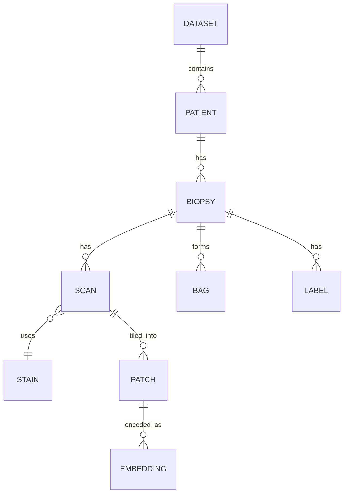

# Data Model

## Entity hierarchy



## Entity definitions

| Entity | Definition |
|---|---|
| **Dataset** | A collection of patients, biopsies, scans, and labels from one source. Has an explicit version. |
| **Patient** | A biological individual, identified globally by `(dataset_id, patient_id)`. The unit splits are computed over. |
| **Patient set** | A named, possibly multi-dataset collection of patients. Splits and bundles derive from it; see [Cohorts vs. splits](#cohorts-vs-splits). |
| **Cohort** | A role partition of a patient set — `development` or `holdout`. Not the same as a fold split. |
| **Biopsy** | A tissue sample from one patient. The unit labels and bags are keyed on. |
| **Scan** | A digitized WSI from one biopsy and one stain. Any OpenSlide-supported format. |
| **Stain** | The staining method applied to a scan (e.g. H&E and IHC stains). |
| **Patch** | A crop extracted from a scan at a configured size and resolution. |
| **Embedding** | A feature vector produced from a patch by an embedding model. |
| **Bag** | The set of patch embeddings used as one model input instance. |
| **Label** | A target value attached to a biopsy. Has a name, type, and value. Optional. |

---

## Cohorts vs. splits

Two levels, two vocabularies — so the word "test" is never overloaded.

**Cohort** — a *patient-level* partition of a patient set. Exactly two roles:

- **`development`** — patients used for model development; all cross-validation happens here.
- **`holdout`** — a small but important set of patients locked away from all development, evaluated **once** at the end (aka "lockbox").

**Split** — *fold-level* roles assigned **within the development cohort** by the seed config:

- **`train`** / **`val`** / **`test`** — per fold.

!!! tip "The rule that kills the ambiguity"
    `train` / `val` / `test` only ever describe **folds inside the development cohort**. The reserved patients are only ever the **holdout cohort** — never called "test". So a **CV test score** (cross-validated, development) and a **holdout score** (the locked cohort) are unambiguous and clearly distinct.

### Bundles and cohorts

A **bundle** materializes a patient set for one `(stain · embedding model · source variant · patch config)`. It contains **every** bag of the set, each tagged with its `cohort` role. **Cohort is a column in the bundle manifest, not a separate bundle** — there is one bundle, not one per cohort.

Stages then pick a **cohort scope** (an enum, never a list):

| Scope | Used by | Meaning |
|---|---|---|
| `development` | Training (CV) | bags tagged `development`; folds (train/val/test) assigned within |
| `holdout` | Evaluation | the locked cohort; scored once |
| `all` | Final retrain | `development` ∪ `holdout`; only after holdout is consumed |

So "train on the union" is `cohort: all` — a single scope value, **not** an assembled list of cohorts. Because folds are assigned to *patients* in the set, every stain/embedding bundle built from the same set inherits the **same fold split**.

### Leakage guarantees

- No patient appears in more than one of `train` / `val` / `test` within a fold (patient-level splitting).
- Holdout patients never appear in **any** fold of any development model.

---

## Source variants

A scan exists in up to three **source variants**, produced in [WSI Transformation](04-wsi-transformation.md):

- **`raw`** — original scan; misaligned across stains. **All training and metrics use this.**
- **`rigid`** — rotation/translation only; coarsely aligned, artifact-free.
- **`elastic`** — tightly aligned to H&E for overlays, at the cost of local tissue distortion.

The source variant is a first-class identifier component, not folded into the patching configuration, because it changes the pixel content patches are drawn from.

---

## Identifiers

All identifiers are stable and recorded in manifests, never inferred from filenames alone.

| Identifier | Notes |
|---|---|
| `dataset_id` | Explicit version, never `latest` |
| `patient_id` | Unique within dataset |
| `biopsy_id` | Unique within patient |
| `scan_id` | One per (biopsy, stain) |
| `patch_config_id` | Patch size, resolution, overlap/stride |
| `source_variant` | `raw` / `rigid` / `elastic` |
| `embedding_model_id` | Model name + version |
| `patient_set_id` | Named patient set (e.g. `prostate_combined_v1`) |
| `cohort` | `development` / `holdout` — a per-bag tag, not an id |
| `bundle_id` | `{patient_set_id}__s{stains}__patch-{patch_config_id}__src-{source_variant}__emb-{embedding_model_id}` |
| `experiment_id` | Umbrella grouping name; groups runs across bundles (e.g. `ki67_stain_comparison`) |
| `run_id` | One training run; generated from the experiment fan-out, carries tags |
| `bag_id` | Fully qualified — see below |

### Bag naming

A bag is identified by dataset origin, patient, biopsy, stain, patching configuration, source variant, and embedding model:

```
bag_id = {dataset_id}__p{patient}__b{biopsy}__s{stain}__patch-{patch_config_id}__src-{source_variant}__emb-{embedding_model_id}
```

Source variant is kept as its own field so that raw / rigid / elastic bags for the same biopsy are distinct and traceable.

---

## Storage formats

Binary is the source of truth; GeoJSON is the view. Anything meant for interactive inspection in TissUUmaps is also exported as GeoJSON, but the pipeline never depends on the GeoJSON for computation.

Detailed layouts live in the [format specs](../formats/beam.md); this is the overview.

| Artifact | Format | Spec |
|---|---|---|
| Embeddings | **HDF5** (binary, per scan) | [Embeddings & patches](../formats/embeddings-and-patches.md) |
| Patch coordinates | **HDF5** (binary arrays) | [Embeddings & patches](../formats/embeddings-and-patches.md) |
| Tissue outlines | **Polygon arrays** (+ GeoJSON export) | [Outlines](../formats/outlines.md) |
| Patch / tissue geometry for viewing | **GeoJSON** | [Outlines](../formats/outlines.md) |
| Transformation matrices | JSON | — |
| Evaluation results | **BEAM** (HDF5) | [BEAM](../formats/beam.md) |
| Heatmaps | PNG + GeoJSON | [Heatmaps](08-heatmaps.md) |

---

## Label model

Labels are keyed per biopsy (by patient, biopsy, stain). Each label carries:

- **Name** — identifier.
- **Type** — binary, continuous, categorical, etc.
- **Value**.

Raw labels come from the ingestion CSV; **derived labels** (averages, max, binary thresholds, …) are computed in [Dataset Preprocessing](05-dataset-preprocessing.md). The set of derived labels is intentionally extendable per dataset.

!!! note "Labels are optional"
    A bundle prepared for evaluation-only on an external dataset may carry no labels at all. Every downstream stage must tolerate their absence.

!!! note "Quartiles are metadata, not geometry"
    Some scores (e.g. proliferation/expression indices) arrive as four per-biopsy quartile values. Because region information is unavailable, the quartile is carried as metadata only — it is **not** a spatial index — and the values are averaged in preprocessing.
