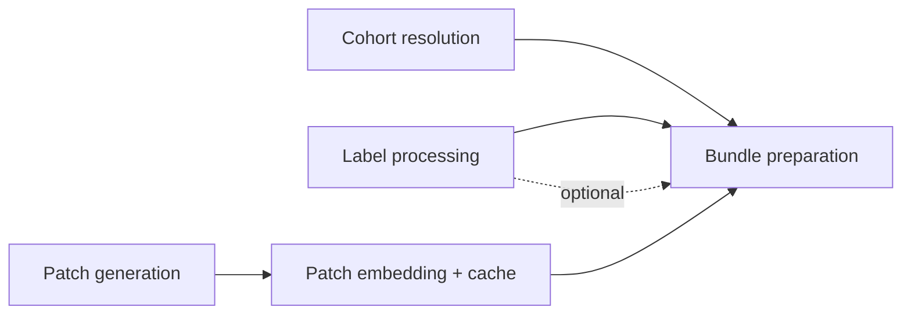

# Stage 3 · Dataset Preprocessing

A whole-slide image is far too large to feed to a model whole, so this stage cuts each slide into small tiles (**patches**), runs every tile through an AI model that turns it into a compact numeric fingerprint (an **embedding**), and then gathers everything one experiment needs — the embeddings, the labels, and which patients belong — into a single self-contained package called a **bundle**. It also decides, up front, *which* patients an experiment runs on ([cohort resolution](#cohort-resolution)).

> **In** scans, tissue outlines, source labels · **Out** cached patch embeddings + bundles (prepared cohorts)

*Go deeper: [Specification](../spec/preprocessing.md) · [Implementation](../impl/preprocessing.md).*

Label processing is independent of registration and runs in parallel; patch generation consumes the outlines from [WSI Transformation](04-wsi-transformation.md).

## Cohort resolution

The first step. A [cohort](../configs/cohorts.md) definition is resolved into a frozen, hashed membership — which patients take part, and in which role — and validated: the members exist, the holdout set is clean, and pooled labels are comparable across sources. The result is written up as a cohort HTML report (composition by dataset and role, plus label distributions). It runs on its own (the `cohort` target), so a cohort can be sanity-checked before any heavy compute, and everything downstream — bundles and folds — derives from this one frozen membership.

---

## Label processing

Computes derived labels (average, max, binary thresholds, …) from the raw scores for downstream training. The exact set is defined later and must stay extendable and adjustable per dataset. Each derived label carries a **name**, **type**, and **value** (see [Data Model · Label model](02-data-model.md#label-model)).

Labels are optional — a preprocessing run for evaluation-only on an external dataset may have none, and downstream stages must tolerate their absence.

---

## Patch generation

Generates patches from the tissue outlines according to the configured patching strategy (size, resolution, overlap/stride).

Patch **coordinates** are stored as binary HDF5 arrays (not pixel crops — pixels are read from the WSI on demand). A GeoJSON export of the patch geometry is available for TissUUmaps viewing. → [Embeddings & patches spec](../formats/embeddings-and-patches.md).

---

## Patch embedding

Embeds the patches with the selected embedding model.

Snakemake cannot track individual patches — there are far too many — but it doesn't need to: embeddings are cached **per scan, per configuration**.

### Embedding cache

Embeddings for a scan are stored as binary HDF5, **one file per `(scan, source variant, embedding model, patch config)`**. The file **path encodes those identifiers**, so the workflow tracks it directly: a configuration that has already been embedded is skipped, and changing the patch config (size/overlap) or model writes a new file. Because the cohort is not part of the path, an embedding computed once is reused automatically by every cohort and bundle that needs it. → [Embeddings & patches spec](../formats/embeddings-and-patches.md).

---

## Bundle preparation

A bundle is a prepared cohort: one [cohort](../configs/cohorts.md), fixed to a single choice of stain, embedding model, source variant, and patch configuration. It is the self-contained package handed to the model stages. Assembling one is cheap — mostly symlinks — so many bundles can be built from the same cached embeddings.

A bundle folder contains:

- A bundle manifest — one row per bag, with its patient `role` (`development` / `holdout`), patient/biopsy ids, and embedding path.
- A label CSV — **all** labels, regardless of the eventual target (absent for label-free evaluation bundles).
- Symlinked or copied embedding (HDF5) and tissue (GeoJSON) files; patch coordinates as HDF5.
- Metadata — cohort + frozen membership hash, embedding model, patch settings, source variant, **plus the entity-level metadata columns forwarded from the [scan manifest](03-data-ingestion.md#the-scan-manifest)**.

### One bundle, roles as tags

The bundle contains **every** patient of the cohort; each bag is tagged with its `role` from the cohort definition. There is **not** a separate bundle per role. Stages select a **subset** — `development`, `holdout`, or `all` — rather than juggling a list of bundles. See [Data Model · Bundles](02-data-model.md#bundles).

A bundle is not training-specific: the same one can feed CV training (`development`), final holdout evaluation (`holdout`), or a final retrain (`all`). An external evaluation set is simply a different cohort with its own bundle, possibly without labels.

!!! note "Folds are NOT generated here"
    This is deliberate, to support the **seed sweep** (see [Model Training](06-model-training.md)). Folds are assigned at training time over the `development` patients; the bundle carries only the role tag, not fold assignments.

!!! warning "No fitted statistics in bundles"
    Bundles carry **raw** labels and embeddings only. Any *fitted* quantity — label normalization mean/std, distribution-derived thresholds, class weights — must be computed at training time from the **training fold only**, never at bundle-preparation time. Combined with holdout patients being filtered out of all folds, this keeps holdout strictly leakage-free. See [Open Questions](09-open-questions.md#patient-exclusion-leakage).

---

## Open items

- Define the exact bundle manifest schema (shared by training and evaluation).
