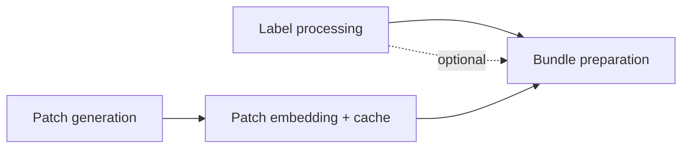

# Stage 3 · Dataset Preprocessing

Turns normalized scans and their transformation outputs into patch embeddings, then packages everything a single training or evaluation run needs into a **bundle**.

Label processing is independent of registration and runs in parallel; patch generation consumes the outlines from [WSI Transformation](04-wsi-transformation.md).

---

## Label processing

Computes derived labels (average, max, binary thresholds, …) from the raw scores for downstream training. The exact set is defined later and must stay extendable and adjustable per dataset. Each derived label carries a **name**, **type**, and **value** (see [Data Model · Label model](02-data-model.md#label-model)).

Labels are optional — a preprocessing run for evaluation-only on an external dataset may have none, and downstream stages must tolerate their absence.

---

## Patch generation

Generates patches from the tissue outlines according to the configured patching strategy (size, resolution, overlap/stride).

Patch **coordinates** are stored as binary HDF5 arrays (not pixel crops — pixels are read from the WSI on demand). A GeoJSON export of the patch geometry is available for TissUUmaps viewing. → [Embeddings & patches spec](../formats/embeddings-and-patches.md).

---

## Patch embedding

Embeds the patches with the selected embedding model.

Snakemake cannot track individual patches — there are far too many — but we want to avoid recomputing embeddings across overlap settings, since a 50% overlap grid shares all of a no-overlap grid's patch positions.

### Content-addressed embedding cache

Each embedding is keyed by its **WSI patch coordinates + patch size + resolution + embedding model + source variant**, stored per scan as binary **HDF5**. Any run looks up by key and embeds only cache misses, so:

- Different overlap settings simply produce different coordinate sets.
- Shared positions reuse cached embeddings automatically.

This avoids relying on one grid being a structural subset of another, which breaks under outline cropping, edge handling, or a shifted grid origin. This is the recommended approach; alternatives are weighed in [Open Questions](09-open-questions.md#embedding-reuse-strategy).

### Augmentation

Data augmentation belongs to this stage, not training, because meaningful histology augmentation (flips, rotations, stain/color jitter) changes the pixels the embedding model sees — so each augmented patch must be run through the **foundation model** and embedded.

Augmented variants are embedded and cached as **their own embedding sets** (the augmentation variant is part of the cache key). Training then chooses whether to sample them. This keeps the expensive foundation-model work out of the training loop and reuses augmented embeddings across runs.

---

## Bundle preparation

A **bundle** materializes one [patient set](../configs/patient_sets.md) for one `(stain · embedding model · source variant · patch config)`. It is the self-contained hand-off unit to the model stages. Assembly is cheap (mostly symlinks), so many bundles are built from the same cached embeddings.

A bundle folder contains:

- A bundle manifest — one row per bag, with its `cohort` tag (`development` / `holdout`), patient/biopsy ids, and embedding path.
- A label CSV — **all** labels, regardless of the eventual target (absent for label-free evaluation bundles).
- Symlinked or copied embedding (HDF5) and tissue (GeoJSON) files; patch coordinates as HDF5.
- Metadata — patient set + frozen membership hash, embedding model, patch settings, source variant, **plus the entity-level metadata columns forwarded from the [scan manifest](03-data-ingestion.md#scan-manifest-the-contract)**.

### One bundle, cohorts as tags

The bundle contains **every** bag of the patient set; each is tagged with its cohort role from the patient set definition. There is **not** a separate bundle per cohort. Stages select a **cohort scope** — `development`, `holdout`, or `all` — rather than juggling a list of bundles. See [Data Model · Bundles and cohorts](02-data-model.md#bundles-and-cohorts).

A bundle is not training-specific: the same one can feed CV training (`development`), final holdout evaluation (`holdout`), or a final retrain (`all`). An external evaluation set is simply a different patient set with its own bundle, possibly without labels.

!!! note "Folds are NOT generated here"
    This is deliberate, to support the **seed sweep** (see [Model Training](06-model-training.md)). Folds are assigned at training time over the `development` cohort; the bundle carries only the cohort tag, not fold assignments.

!!! warning "No fitted statistics in bundles"
    Bundles carry **raw** labels and embeddings only. Any *fitted* quantity — label normalization mean/std, distribution-derived thresholds, class weights — must be computed at training time from the **training fold only**, never at bundle-preparation time. Combined with the holdout cohort being filtered out of all folds, this keeps holdout strictly leakage-free. See [Open Questions](09-open-questions.md#patient-exclusion-leakage).

---

## Open items

- Define the exact bundle manifest schema (shared by training and evaluation).
