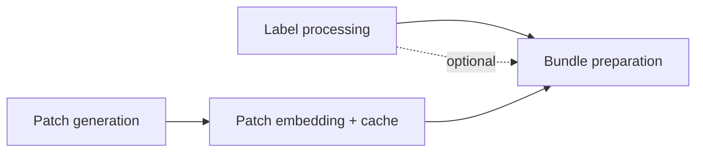

# Stage 3 · Dataset Preprocessing

Turns normalized scans and their transformation outputs into patch embeddings, then packages everything a single training or evaluation run needs into a **bundle**.

Label processing is independent of registration and runs in parallel; patch generation consumes the outlines from [WSI Transformation](04-wsi-transformation.md).

---

## Label processing

Computes derived labels (average, max, binary thresholds, …) from the raw scores for downstream training. The exact set is defined later and must stay extendable and adjustable per dataset. Each derived label carries a **name**, **type**, and **value** (see [Data Model · Label model](02-data-model.md#label-model)).

Labels are optional — a preprocessing run for evaluation-only on an external dataset may have none, and downstream stages must tolerate their absence.

---

## Patch generation

Generates patches from the tissue outlines according to the configured patching strategy (size, resolution, overlap/stride).

Patch **coordinates** are stored as binary HDF5 arrays (not pixel crops — pixels are read from the WSI on demand). A GeoJSON export of the patch geometry is available for TissUUmaps viewing. See [Storage formats](02-data-model.md#storage-formats).

---

## Patch embedding

Embeds the patches with the selected embedding model.

Snakemake cannot track individual patches — there are far too many — but we want to avoid recomputing embeddings across overlap settings, since a 50% overlap grid shares all of a no-overlap grid's patch positions.

### Content-addressed embedding cache

Each embedding is keyed by its **WSI patch coordinates + patch size + resolution + embedding model + source variant**, stored per scan as binary **HDF5**. Any run looks up by key and embeds only cache misses, so:

- Different overlap settings simply produce different coordinate sets.
- Shared positions reuse cached embeddings automatically.

This avoids relying on one grid being a structural subset of another, which breaks under outline cropping, edge handling, or a shifted grid origin. This is the recommended approach; alternatives are weighed in [Open Questions](08-open-questions.md#embedding-reuse-strategy).

---

## Bundle preparation

Produces a single self-contained **bundle** folder with everything one training or evaluation run needs:

- A CSV mapping labels — **all** dataset labels are included, regardless of the eventual target (absent for label-free evaluation bundles).
- Symlinked or copied embedding (HDF5) and tissue (GeoJSON) files; patch coordinates as HDF5.
- Metadata (embedding model, patch settings, source variant, …).

A bundle is not training-specific: the same preprocessing output can feed an evaluation-only run on an external dataset, possibly without labels.

!!! note "Folds are NOT generated here"
    This is deliberate, to support the **seed sweep** (see [Model Training](06-model-training.md)), which trains and evaluates across a varying number of model seeds and fold seeds for a more accurate estimate. Folds belong to the training stage.

!!! warning "No fitted statistics in bundles"
    Bundles carry **raw** labels and embeddings only. Any *fitted* quantity — label normalization mean/std, distribution-derived thresholds, class weights — must be computed at training time from the **training split only**, never at bundle-preparation time across all patients. This is what guarantees the patient-exclusion bundles below share no derived state. See [Open Questions](08-open-questions.md#patient-exclusion-leakage).

### Patient exclusion

Patient exclusion is a designed-in feature. A Snakemake config flag plus an array of patients to exclude from training produces three bundle variants:

| Bundle | Contents | Use |
|---|---|---|
| Training | All patients **minus** the test set | Model development |
| Full | All patients | Final training on the full cohort |
| Held-out | Test set only | Leakage-free held-out evaluation |

This guarantees a chosen set of patients can be fully excluded from training, so held-out evaluation has no leakage.

---

## Open items

- Define the exact bundle schema (shared by training and evaluation).
