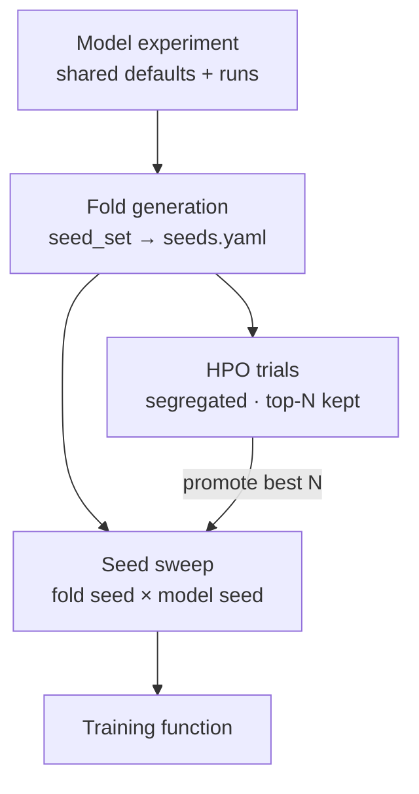

# Stage 4 · Model Training

This is where a model learns to predict a biopsy's score from its bag of patch embeddings. A single training run can be a fluke — of how the patients happened to be split, or of the random numbers the model started from — so instead of trusting one run we train the same setup many times over different splits and random seeds (the **seed sweep**) and look at the spread. Searching for good model settings in the first place (hyperparameter optimization, **HPO**) is a separate, much larger search kept off to the side. (Evaluation-only runs skip this stage and go straight to [Stage 5](07-evaluation.md).)

> **In** a bundle (`development` subset) + a `seed_set` · **Out** per-fold checkpoints, metrics, run records

*Go deeper: [Specification](../spec/training.md) · [Implementation](../impl/training.md).*

---

## Model experiments and runs

An [experiment config](../configs/experiment.md) holds shared `defaults` plus an explicit list of **runs**, each a named variation (a different bundle, or different hyperparameters) with a `run_id`. Each run still **fans out over the seed sweep**. HPO is an optional `hpo` block in the same file. Every run emits a **run record** aggregated into `runs.parquet` (see [Reports](11-reports.md)).

A run operates on its bundle at the **`development`** subset (or `all` for a final retrain after holdout). Folds are assigned only over `development` patients; `holdout` patients are filtered out and never enter a fold.

## Fold generation

Folds are the cross-validation partitions, drawn from fold seeds over the **development patients** of the bundle's [cohort](../configs/cohorts.md). They are named and reused, not invented per run: a project-wide split registry ([`seeds.yaml`](../configs/seeds.md)) holds every split configuration under `seed_sets`, and a run picks one by name with `seed_set:`. Two consequences fall out of this:

- Any models sharing a `seed_set` name get identical splits — so their results are directly comparable.
- Because folds are assigned to *patients* (not to bags), every stain/embedding bundle built from the same cohort inherits the same split automatically.

The bundle's cohort and the `seed_set`'s cohort must match; this is validated.

!!! warning "Membership changes invalidate splits"
    Splits are computed against the cohort's frozen, hashed membership. If membership changes (the hash differs), the pipeline raises a prominent warning that splits are stale.

---

## Seed sweep

Runs the training function across all combinations of **fold seed** and **model seed**, varied independently:

- The **model seed** controls random weight initialization.
- The **fold seed** controls the split.

It aggregates results and emits train/test/loss plots plus a CSV (or similar) of performance and metrics, for a clear view of model behavior.

---

## Hyperparameter optimization

Supports grid search and a Bayesian optimizer (e.g. Optuna / TPE), declared as a search space in an optional `hpo` block of the [experiment config](../configs/experiment.md). Keeping HPO as one block per experiment means hundreds of trials add no extra config files.

HPO is kept apart from the seed sweep, because HPO models are rarely looked at again while the sweep models are the ones you keep:

- HPO outputs live under `results/experiments/{name}/hpo/` with their **own index**; the seed-sweep models live under `sweep/`, easy to find.
- `pipeline.yaml`'s `reports.hpo.keep_checkpoints` decides storage (`all` / `top_n` / `none`); by default only the **top-N** are retained.
- **Workflow:** HPO explores → promote the best N hyperparameters → run a **seed sweep** on them. The sweep is the durable result; HPO is exploratory.

---

## Training function

### Input

- Path to bundle (exact schema TBD).
- Folds CSV.
- Model seed.
- Hyperparameters (learning rate, regularization, dropout rates).
- Model architecture — **family → type → specific parameters** (hidden layer sizes, layer count, …). Predefined families include regression and **CLAM** (clustering-constrained attention MIL) / non-CLAM, covering attention mechanisms vs. mean pooling.
- Training name.
- Output directory.

### Output

- Model checkpoint per fold.
- Training history (train + validation), with metrics by task type.
- Test performance.
- Folds used.
- Training logs.

---

## Per-patch axis features (optional)

Each patch already carries its position along the biopsy's curved longitudinal axis — a normalized arc-length position (`axis_t`) and a lateral offset from the axis (`axis_offset`), computed in [WSI Transformation](04-wsi-transformation.md). Setting `append_axis_features: true` in the experiment config concatenates these two scalars onto every patch's embedding when its bag is loaded for training, widening the model's input by two dims automatically (no architecture edits needed for the basic case). Off by default; see [Specification](../spec/training.md) for the mechanics and [Open Questions](09-open-questions.md#axis-feature-encoding) for richer positional encodings (e.g. Fourier features) as a documented future extension.

---

## Label balancing

Training supports correcting for imbalanced targets, configured per run:

- **Classification** — class weights, or weighted/over/under-sampling of bags.
- **Regression** — bin the target and balance across bins (so rare high/low scores are not drowned out).

Balancing is applied **per fold, from the training split only** — consistent with the [no-fitted-statistics rule](05-dataset-preprocessing.md) — so it never leaks distribution information from validation or held-out data.

---

## Metrics by label type

The metric set is selected **per label according to its type**, so a single sweep can report regression and classification targets side by side.

| Label type | Metrics |
|---|---|
| Regression | MAE, Spearman, R², Huber loss |
| Binary / classification | AUROC, accuracy, F1 (and related), as appropriate |
