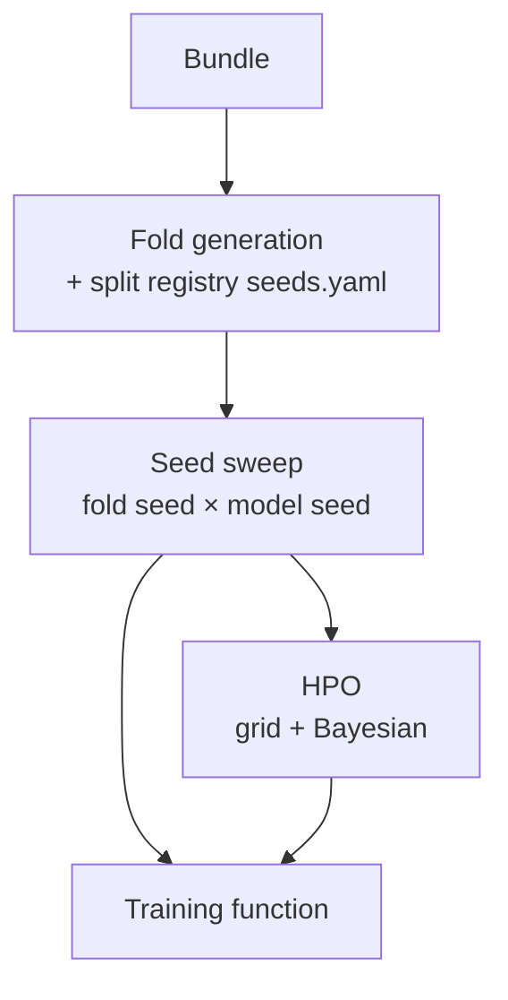

# Stage 4 · Model Training

Given a bundle, this stage either **evaluates it against an already-trained model** or **trains a new one**. The training side is itself a small Snakemake pipeline.

---

## Fold generation

Generates folds from fold seeds. A **split registry** (`seeds.yaml`) is always included: it names a dataset and lists the seeds to use, so all models share identical fold splits and seeds can be referenced later by name.

!!! warning "Patient count changes invalidate splits"
    If the patient count changes, the pipeline raises a prominent warning/error telling the user that splits have been updated.

---

## Seed sweep

Runs the training function across all combinations of **fold seed** and **model seed**, varied independently:

- The **model seed** controls random weight initialization.
- The **fold seed** controls the split.

It aggregates results and emits train/test/loss plots plus a CSV (or similar) of performance and metrics, for a clear view of model behavior.

---

## Hyperparameter optimization

Supports **grid search** and a **Bayesian optimizer** (e.g. Optuna / TPE). Produces an HTML report with easy-to-read visualizations.

---

## Training function

### Input

- Path to bundle (exact schema TBD).
- Folds CSV.
- Model seed.
- Hyperparameters (learning rate, regularization, dropout rates).
- Model architecture — **family → type → specific parameters** (hidden layer sizes, layer count, …). Predefined families include regression and CLAM / non-CLAM, covering attention mechanisms vs. mean pooling.
- Training name.
- Output directory.

### Output

- Model checkpoint per fold.
- Training history (train + validation), with metrics by task type.
- Test performance.
- Folds used.
- Training logs.

---

## Metrics by label type

The metric set is selected **per label according to its type**, so a single sweep can report regression and classification targets side by side.

| Label type | Metrics |
|---|---|
| Regression | MAE, Spearman, R², Huber loss |
| Binary / classification | AUROC, accuracy, F1 (and related), as appropriate |
