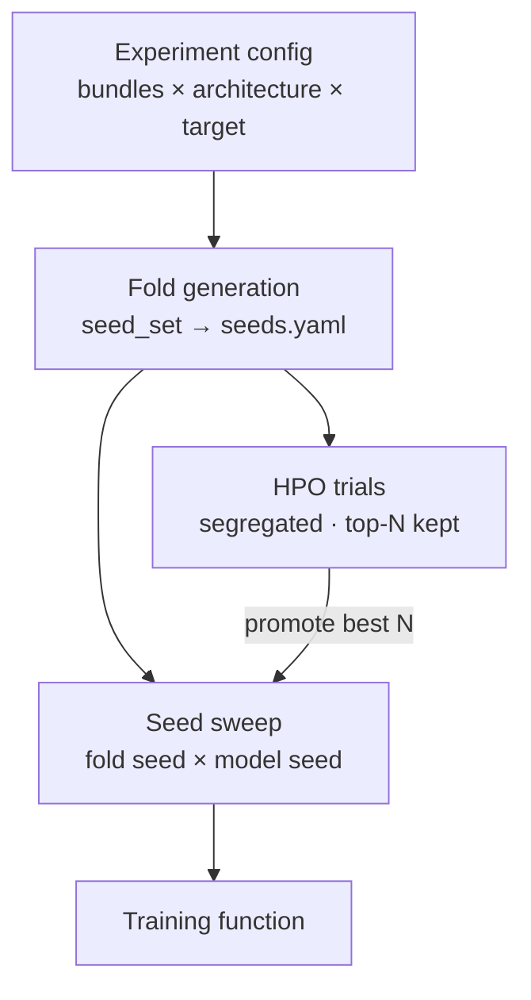

# Stage 4 · Model Training

A bundle is either **evaluated against an existing model** or used to **train new ones**. Training is defined as an **experiment** that fans out into many runs.

---

## Experiments and runs

One [experiment config](../configs/training.md) declares the matrix — `bundles` (possibly several stains/embeddings), architecture, target, seed sweep, optional HPO — and **fans out into many runs**; runs are generated, never written as individual config files. Each run emits a **run record** aggregated into `runs.parquet` (see [Reports](11-reports.md)).

Training operates on a bundle at the **`development`** cohort scope (or `all` for a final retrain after holdout). Folds are assigned only over `development` bags; `holdout` bags are filtered out and never enter a fold.

## Fold generation

Generates folds from fold seeds over the **development cohort** of the bundle's [patient set](../configs/patient_sets.md). A project-wide **split registry** ([`seeds.yaml`](../configs/seeds.md)) holds every seed/split configuration under `seed_sets`, indexed by name; a run picks one with `seed_set:`, so all models sharing that name get identical splits — and because folds are assigned to *patients*, every stain/embedding bundle from the same set inherits the same split.

!!! warning "Membership changes invalidate splits"
    Splits are computed against the patient set's frozen, hashed membership. If membership changes (the hash differs), the pipeline raises a prominent warning that splits are stale.

---

## Seed sweep

Runs the training function across all combinations of **fold seed** and **model seed**, varied independently:

- The **model seed** controls random weight initialization.
- The **fold seed** controls the split.

It aggregates results and emits train/test/loss plots plus a CSV (or similar) of performance and metrics, for a clear view of model behavior.

---

## Hyperparameter optimization

Supports **grid search** and a **Bayesian optimizer** (e.g. Optuna / TPE), declared as a search space in the experiment config — hundreds of trials, zero extra config files.

HPO is **kept apart from the seed sweep**, because HPO models are rarely revisited while the sweep models are the ones you keep:

- HPO outputs live under `results/experiments/{exp}/hpo/` with their **own index**; the seed-sweep models live under `sweep/`, easy to find.
- `reports.yaml → hpo.keep_checkpoints` decides storage (`all` / `top_n` / `none`); by default only the **top-N** are retained.
- **Workflow:** HPO explores → promote the best N hyperparameters → run a **seed sweep** on them. The sweep is the durable result; HPO is exploratory.

---

## Training function

### Input

- Path to bundle (exact schema TBD).
- Folds CSV.
- Model seed.
- Hyperparameters (learning rate, regularization, dropout rates).
- Model architecture — **family → type → specific parameters** (hidden layer sizes, layer count, …). Predefined families include regression and CLAM / non-CLAM, covering attention mechanisms vs. mean pooling.
- Training name.
- Output directory.

### Output

- Model checkpoint per fold.
- Training history (train + validation), with metrics by task type.
- Test performance.
- Folds used.
- Training logs.

---

## Label balancing

Training supports correcting for imbalanced targets, configured per run:

- **Classification** — class weights, or weighted/over/under-sampling of bags.
- **Regression** — bin the target and balance across bins (so rare high/low scores are not drowned out).

Balancing is applied **per fold, from the training split only** — consistent with the [no-fitted-statistics rule](05-dataset-preprocessing.md) — so it never leaks distribution information from validation or held-out data.

## Augmentation

Augmentation is **not** a training concern in this pipeline. Meaningful histology augmentation (flips, rotations, stain/color jitter) changes the pixels the embedding model sees, so it must run the **foundation model** on the augmented patches — that happens in [Dataset Preprocessing](05-dataset-preprocessing.md#augmentation), where each augmented variant is embedded and cached as its own set.

Training only decides **whether to sample** those augmented embedding sets (`use_augmented_embeddings` in [`training.yaml`](../configs/training.md)).

## Metrics by label type

The metric set is selected **per label according to its type**, so a single sweep can report regression and classification targets side by side.

| Label type | Metrics |
|---|---|
| Regression | MAE, Spearman, R², Huber loss |
| Binary / classification | AUROC, accuracy, F1 (and related), as appropriate |
