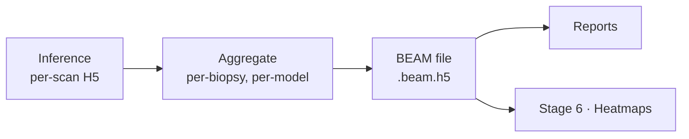

# Stage 5 · Evaluation

Runs inference and saves results per scan, then aggregates the per-scan files into one **BEAM** file per biopsy per model. Heatmaps are produced separately in [Stage 6](08-heatmaps.md).



---

## Evaluation step

### Input

- Path to bundle.
- Path to model (checkpoints, folds, parameters/architecture).
- Evaluation tag — a readable name for the run.

### Output

One **BEAM file per biopsy per model**, plus aggregate reports.

---

## The BEAM format

**BEAM** — *Biopsy Evaluation & Attention Map* — is the project's own per-biopsy, per-model result format. It is stored as **HDF5** and named `{biopsy_id}__{model_id}.beam.h5`.

It collects everything downstream consumers (reports, heatmaps) need in one self-describing file. HDF5 is chosen because it is **appendable**: future enrichment steps can add datasets or groups (extra heatmaps, additional embeddings, new attention variants) without breaking existing readers.

### Layout

```text
{biopsy_id}__{model_id}.beam.h5
  /                         # root attributes (provenance)
      format_version
      biopsy_id, patient_id, dataset_id
      model_id, embedding_model_id
      evaluation_tag
      stain
      source_variant        # raw / rigid / elastic
      patch_config_id, patch_size, patch_resolution
      quartile              # carried metadata, NOT a spatial index
  /prediction               # prediction per model
  /labels                   # true labels where available (name → value, with type attrs)
  /patches
      coords                # (N, 2|4) int — x, y (, w, h) in the WSI frame, binary
      size                  # patch size / resolution
  /attention
      raw                   # (N,)
      sigmoid               # (N,)
      rank                  # (N,)
  /embeddings               # optional (N, D) — included or referenced from the bundle
  /outline                  # tissue outline used (GeoJSON string, or reference)
  /metadata                 # model info, embedding model, registration / source-variant info, free-form
```

### What each field maps to

| Requested field | Location in BEAM |
|---|---|
| Attention (raw, sigmoid, rank) | `/attention/{raw,sigmoid,rank}` |
| Prediction per model | `/prediction` |
| True labels (where available) | `/labels` |
| Stain | root attr `stain` |
| Metadata | `/metadata` |
| Patch size | root attr + `/patches/size` |
| Model info | `/metadata`, root attr `model_id` |
| Embedding model | root attr `embedding_model_id` |
| Patient | root attr `patient_id` |
| Tissue outline used | `/outline` |
| Patches | `/patches/coords` |
| Quartile | root attr `quartile` |
| Registration / source variant | root attr `source_variant`, `/metadata` |

---

## Reports

Aggregated across biopsies and models from the BEAM files — performance tables and per-model summaries. (Exact report contents TBD.)
