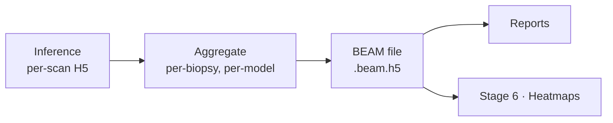

# Stage 5 · Evaluation

Runs inference and saves results per scan, then aggregates the per-scan files into one **BEAM** file per biopsy per model. Heatmaps are produced separately in [Stage 6](08-heatmaps.md).

---

## Evaluation step

### Input

- Path to bundle.
- Path to model (checkpoints, folds, parameters/architecture).
- Evaluation tag — a readable name for the run.

### Output

One **BEAM file per biopsy per model**, plus aggregate reports.

---

## The BEAM format

**BEAM** — *Biopsy Evaluation & Attention Map* — is the project's own per-biopsy, per-model result format, stored as **HDF5** (`{biopsy_id}__{model_id}.beam.h5`). HDF5 is chosen because it is **appendable**: enrichment steps can add fields without breaking existing readers.

Roughly, one BEAM file holds:

- **Attention** per patch — raw, sigmoid, rank.
- **Prediction(s)** for the biopsy and **true labels** where available.
- **Patch coordinates** (WSI frame) and patch size.
- **Tissue outline** used, as a polygon array, optionally divided into quartiles.
- **Provenance** — patient, stain, source variant, model, embedding model, patch config.
- **Free-form metadata**; quartile carried as metadata.

→ Full layout and field mapping: **[BEAM format spec](../formats/beam.md)**.

---

## Reports

Aggregated across biopsies and models from the BEAM files — performance tables and per-model summaries. (Exact report contents TBD.)
