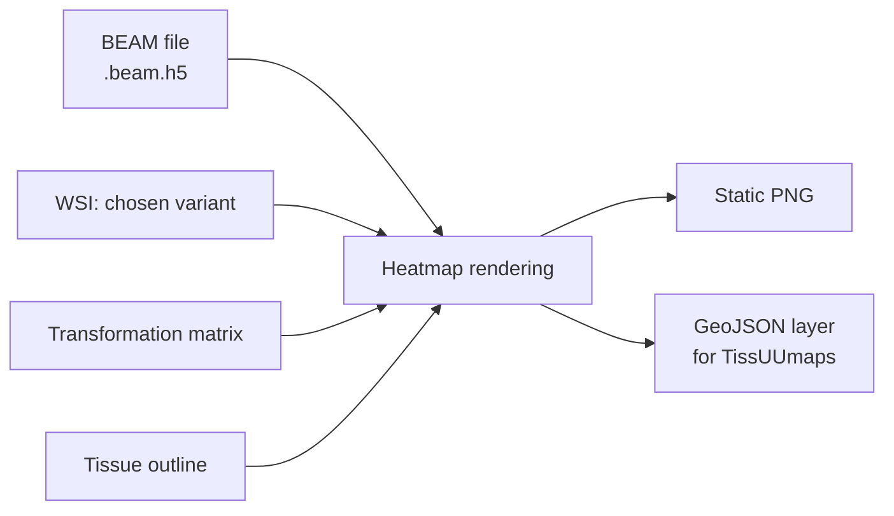

# Stage 6 · Heatmap Generation

A heatmap paints a model's attention back onto the slide — colouring each region by how much it counted toward the prediction — so a pathologist can see *where* the model looked, not just what it scored. This stage builds those overlays from a [BEAM file](07-evaluation.md#the-beam-format), as both static figures and interactive layers for the TissUUmaps viewer.

> **In** BEAM + WSI variant + transformation matrix + outline · **Out** static PNG + TissUUmaps GeoJSON layer

---

## Inputs

- **BEAM file** — attention (raw / sigmoid / rank), patch coordinates, prediction, labels, metadata.
- **WSI** in the chosen source variant — `raw`, `rigid`, or `elastic`, depending on the alignment the visual needs (see [WSI Transformation](04-wsi-transformation.md#training-vs-heatmap-roles)).
- **Transformation matrix** for that variant.
- **Tissue outline** for that variant.

!!! warning "Coordinates must be transformed to the underlay frame"
    Attention is computed on **raw** patches, so the patch coordinates in the BEAM file live in the **raw** WSI frame. To overlay them on a `rigid` or `elastic` underlay, the coordinates must be pushed through that variant's transformation matrix first. Skipping this silently misplaces every patch.

---

## What makes a good heatmap for this project

| Concern | Approach |
|---|---|
| **Value mapping** | Raw attention is peaky. Default to **rank (percentile)** coloring for readable, outlier-robust maps; offer sigmoid and raw as alternatives. |
| **Colormap** | Perceptually uniform (e.g. viridis / magma) so attention is read accurately; reserve diverging maps for signed quantities. |
| **Underlay choice** | `raw` (no alignment), `rigid` (clean coarse alignment), `elastic` (tight cross-stain overlay). |
| **Cross-stain overlays** | Because elastic aligns IHC stains to H&E, a model's attention from one stain can be overlaid on another stain's morphology, or shown as aligned side-by-side panels. |
| **Scale correctness** | Use patch resolution / mpp to render at an appropriate downsample and to draw a scale bar. |
| **Tissue masking** | Draw the outline boundary and dim non-tissue regions so attention reads against actual tissue. |
| **Provenance on the figure** | Title/caption with biopsy_id, prediction vs. true label, stain, model + embedding model, source variant, attention type, and colormap. Include a colorbar. |

---

## Outputs

- **Static PNG** — attention/prediction heatmap overlaid on the chosen variant, with colorbar, scale bar, outline, and provenance caption.
- **GeoJSON layer for TissUUmaps** — patch polygons carrying attention values as feature properties, so values are inspectable interactively against the WSI. TissUUmaps is already part of the project's viewing workflow, so this is a first-class output, not an afterthought.
- **Heatmap metadata** — which BEAM file, model, checkpoint, source variant, colormap, and attention type produced it.
