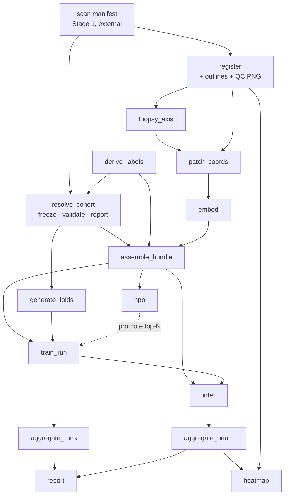

# Impl · Snakemake workflow

How the stages become Snakemake rules — the rules, their wildcards, dependencies, and the config that drives each. This is the concrete map of *what gets built*.

## Orchestration model

- **Stage 1 (Ingestion) is outside Snakemake** — a user bridge writes the normalized scans + [scan manifest](../design/03-data-ingestion.md#the-scan-manifest). The DAG starts from that manifest.
- **Stages 2–6 are Snakemake.** Each stage is independently runnable via a **named target**; one top-level workflow chains them.
- **Config layering:** [`base.yaml`](../configs/base.md) (roots + registries) is always loaded; the stage's config supplies the rest; the [`cohorts`](../configs/cohorts.md) and [`seeds`](../configs/seeds.md) registries resolve membership and splits. `--configfile base.yaml <stage>.yaml`.
- **Execution:** rules carry `resources:` (gpu/mem/runtime); a cluster-generic SLURM profile dispatches workers; heavy rules (`embed`, `train_run`) run on GPU.

## Wildcards (the DAG axes)

| Wildcard | Meaning |
|---|---|
| `dataset`, `patient`, `biopsy`, `scan` | entity ids (`scan` = biopsy × stain) |
| `stain` | `HE` / `Ki67` / `PSA` |
| `variant` | `raw` / `rigid` / `elastic` |
| `patch_config` | patch size · resolution · overlap |
| `embedding_model` | embedder id |
| `cohort`, `bundle_id` | named cohort; prepared-cohort id |
| `seed_set`, `fold_seed`, `model_seed` | split set + the two swept seeds |
| `model_experiment`, `run_id` | umbrella + one run |

## Rules by stage

### Stage 2 · WSI Transformation — `pipeline.yaml` (`wsi_transformation`)

| Rule | Per | Inputs → Outputs |
|---|---|---|
| `register` | patient | normalized scans → registered OME-TIFFs + `transform.json` + **outline** `…/outlines/{scan}__{variant}.geojson` (single configured `tissue_method`) + **cross-stain intersection** + **QC PNG**. `debug_compare_methods` additionally writes the other method's outline + comparison overlay under `roots.debug` (never read downstream) |
| `biopsy_axis` | scan | outline → `…/axis/{scan}.json` (PCA axis + quartile cuts) |

`register` does registration **and** outlines in one rule — VALIS already segments tissue and holds the transforms, so a separate outline rule would re-derive both. `biopsy_axis` stays separate (pure geometry on the outline); it can be inlined into `register` if preferred.

### Stage 3 · Dataset Preprocessing — `pipeline.yaml` (`preprocessing`)

| Rule | Per | Inputs → Outputs |
|---|---|---|
| `resolve_cohort` | cohort | `cohorts.yaml` entry + member manifests + derived labels → `processed/cohorts/{cohort}/membership.csv` (+ hash) + **validation** + `results/reports/cohorts/{cohort}.html` |
| `derive_labels` | dataset | raw labels → `processed/{dataset}/labels_derived.csv` |
| `patch_coords` | scan × variant × patch_config | outline + axis → `…/coords/{patch_config}/{scan}__{variant}.h5` |
| `embed` | scan × variant × patch_config × embedding_model | coords + WSI → `…/embeddings/{embedding_model}/{scan}__{variant}__{patch_config}.h5` (file-level cache; the path is the key) |
| `assemble_bundle` | bundle | embeddings + derived labels + **resolved cohort** → `bundles/{bundle_id}/` (manifest, labels, symlinks, metadata) |

`resolve_cohort` is the first thing preprocessing does: it freezes membership (so the hash can detect drift), validates it, and emits the cohort report — runnable on its own (`cohort` target) before any heavy compute.

### Stage 4 · Model Training — `experiments/<name>.yaml`, `seeds.yaml`

| Rule | Per | Inputs → Outputs |
|---|---|---|
| `generate_folds` | seed_set × target × fold_seed | cohort dev patients + seeds → `results/folds/{seed_set}/{target}/{fold_seed}.csv` (target in the key only when stratified) |
| `train_run` | run_id × fold_seed × model_seed | bundle + folds → `results/experiments/{exp}/sweep/{run_id}/` (checkpoints, metrics, `run.json`) |
| `aggregate_runs` | — | all `run.json` → `results/runs.parquet` |
| `hpo` | hpo name | bundle + search space → `results/experiments/{name}/hpo/` (Optuna; segregated, top-N) |

### Stage 5 · Evaluation — `base.yaml` defaults + CLI targets

| Rule | Per | Inputs → Outputs |
|---|---|---|
| `infer` | sweep model (per checkpoint, patients batched) | each model in the sweep + bundle (subset) → per-bag predictions/attention, via [out-of-fold / ensemble checkpoint routing](../spec/evaluation.md#checkpoint-routing-the-crux) |
| `aggregate_beam` | biopsy × sweep | per-bag results from every contributing model → `…/beam/{run_family}/{biopsy}__{run_family}.beam.h5` |

### Stage 6 · Heatmaps — `base.yaml` defaults + CLI targets

| Rule | Per | Inputs → Outputs |
|---|---|---|
| `heatmap` | biopsy × variant | BEAM + WSI(variant) + transform + outline → `results/heatmaps/{biopsy}__{stain}.png` + `.geojson` |

### Reports — `pipeline.yaml` (`reports`)

| Rule | Per | Inputs → Outputs |
|---|---|---|
| `report` | — | `runs.parquet` + manifests + BEAM → `results/reports/` (HTML) |

## Dependency DAG



## Named targets

Each stage exposes a target so it can run alone; `all` runs the chain.

```text
register · cohort · coords · embeddings · bundles
folds · train · hpo · evaluate · heatmaps · reports · all
```

## Dynamic fan-out (checkpoints)

Some rule sets are unknown until inputs are read, so they sit behind Snakemake **checkpoints**:

- **Cohort resolution** — `resolve_cohort` freezes which `(patient, biopsy, stain)` exist and their roles; the resulting membership gates `assemble_bundle` and `generate_folds`.
- **Model-experiment expansion** — the `runs` list × `fold_seeds` × `model_seeds` expands into concrete `train_run` jobs.
- **Evaluation set** — the biopsies present in a bundle determine the `aggregate_beam` jobs.

## File-level embedding cache

Embeddings are stored one file per `(scan, variant, patch_config, embedding_model)`, with the configuration encoded in the path, so the cache **is** the DAG: Snakemake skips a configuration whose file already exists and rebuilds only the ones that changed. A changed `patch_config` is simply a new output path, and reuse across cohorts is automatic because the cohort is not part of the path.

## Job grouping (avoid the small-job explosion)

The `scan × variant × patch_config × embedding_model` matrix expands into many short jobs; submitting one SLURM job each would drown the scheduler in overhead. Use Snakemake **`group`** directives to pack many `patch_coords` / `embed` tasks into a single allocation (e.g. group by scan or by patient), and process several scans per worker while a GPU is already warm. The aim is a few well-sized jobs, not thousands of seconds-long ones.

## Configuration → rules

| Config | Drives |
|---|---|
| `base.yaml` | roots + registries + evaluation/heatmap defaults for **every** rule |
| `cohorts.yaml` | `resolve_cohort` (validate + freeze + report) |
| `seeds.yaml` | `generate_folds` |
| `pipeline.yaml` → `wsi_transformation` | `register` (registration + outlines + QC PNG), `biopsy_axis` |
| `pipeline.yaml` → `preprocessing` | `derive_labels`, `patch_coords`, `embed`, `assemble_bundle` |
| `pipeline.yaml` → `reports` | `report` |
| `experiments/<name>.yaml` | `train_run`, `aggregate_runs`, `hpo` |
| CLI targets + `base.yaml` defaults | `infer`, `aggregate_beam`, `heatmap` |
