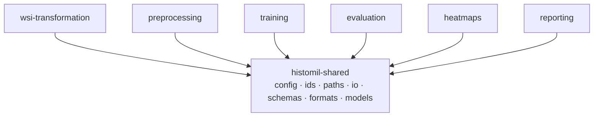

# 01 · Repository layout

The repo is a **uv workspace**: each of the six stages plus reporting is its own installable
distribution under `components/`, every one depending on a single `histomil-shared` package and
never on a sibling. Each component owns its code, its configs, its Snakemake rules, and its
tests, so it versions and updates independently. A thin top-level `workflow/` includes each
component's rules into one chained DAG. Nothing computes from the directory tree
([principle 2](README.md#guiding-principles-for-the-build)); this layout is for humans, packaging,
and independent release.

```text
histo-mil/                              # uv workspace root (currently `design_docs/`)
├─ pyproject.toml                       # [tool.uv.workspace] members = ["components/*"] — see 02
├─ uv.lock                              # ONE shared lock across all components
├─ README.md  CLAUDE.md
├─ docs/                                # the design docs (unchanged, authoritative)
├─ proposed_build/                      # this plan
│
├─ components/                          # one installable distribution per box below
│  │
│  ├─ shared/                           # histomil-shared  →  histomil.shared
│  │  ├─ pyproject.toml                 # the one dependency every other component declares
│  │  ├─ src/histomil/shared/
│  │  │  ├─ config.py                   # pydantic models + base+stage layering loader
│  │  │  ├─ ids.py                      # build/parse scan_id, bag_id, bundle_id
│  │  │  ├─ paths.py                    # roots → concrete paths (the only path authority)
│  │  │  ├─ provenance.py  hashing.py  logging.py
│  │  │  ├─ io/                         # typed IO: h5.py geojson.py tables.py wsi.py
│  │  │  ├─ schemas/                    # executable contracts (pydantic + pandera) — see 06
│  │  │  │   manifest.py labels.py membership.py folds.py bundle.py transform.py axis.py runs.py
│  │  │  ├─ formats/                    # cross-component binary formats
│  │  │  │   beam.py                    # BEAM read/write (written by eval, read by heatmaps+reports)
│  │  │  │   outline.py                 # polygon-array read/write
│  │  │  ├─ report/                     # report TOOLKIT (extra: plotly, jinja2) — see 07
│  │  │  │   toolkit.py  assets/reports.css   # macros + provenance block + standalone CSS
│  │  │  └─ models/                     # model DEFINITIONS shared by preprocess/train/eval
│  │  │     ├─ embedding/               # registry: id → (load(pretrained), NORM)
│  │  │     │   __init__.py base.py uni2_h.py conch.py gigapath.py tenpercent_resnet18.py
│  │  │     └─ mil/                     # base.py clam.py non_clam.py regression.py
│  │  ├─ config/                        # SHARED config: roots + registries
│  │  │   base.yaml  cohorts.yaml  seeds.yaml
│  │  └─ tests/
│  │
│  ├─ wsi_transformation/               # histomil-wsi-transformation → histomil.wsi_transformation
│  │  ├─ pyproject.toml                 # deps: histomil-shared, valis-wsi, opencv, scikit-image
│  │  ├─ src/histomil/wsi_transformation/
│  │  │   register.py outlines.py intersection.py biopsy_axis.py qc.py cli.py
│  │  ├─ config/wsi_transformation.yaml
│  │  ├─ workflow/rules.smk             # rules: register, biopsy_axis
│  │  └─ tests/
│  │
│  ├─ preprocessing/                    # histomil-preprocessing → histomil.preprocessing
│  │  ├─ pyproject.toml                 # deps: histomil-shared, torch, timm, huggingface_hub,
│  │  │                                 #       openslide-python, tifffile, zarr
│  │  ├─ src/histomil/preprocessing/
│  │  │   cohort.py labels.py patching.py embed.py cache.py bundle.py cli.py
│  │  │   cohort_report.py             # cohort HTML page, built via shared.report toolkit
│  │  ├─ config/preprocessing.yaml
│  │  ├─ workflow/rules.smk             # resolve_cohort, derive_labels, patch_coords, embed, assemble_bundle
│  │  └─ tests/
│  │
│  ├─ training/                         # histomil-training → histomil.training
│  │  ├─ pyproject.toml                 # deps: histomil-shared, torch, scikit-learn, optuna
│  │  ├─ src/histomil/training/
│  │  │   folds.py trainer.py balancing.py bagstore.py runrecord.py aggregate.py hpo.py cli.py
│  │  ├─ config/                        # model_experiment.yaml  hpo.yaml
│  │  ├─ workflow/rules.smk             # generate_folds, train_run, aggregate_runs, hpo
│  │  └─ tests/
│  │
│  ├─ evaluation/                       # histomil-evaluation → histomil.evaluation
│  │  ├─ pyproject.toml                 # deps: histomil-shared, torch
│  │  ├─ src/histomil/evaluation/
│  │  │   routing.py infer.py aggregate.py cli.py     # BEAM read/write itself is in shared.formats
│  │  ├─ config/evaluation.yaml
│  │  ├─ workflow/rules.smk             # infer, aggregate_beam
│  │  └─ tests/
│  │
│  ├─ heatmaps/                         # histomil-heatmaps → histomil.heatmaps
│  │  ├─ pyproject.toml                 # deps: histomil-shared, matplotlib, opencv, shapely
│  │  ├─ src/histomil/heatmaps/
│  │  │   warp.py render.py geojson.py cli.py
│  │  ├─ config/heatmaps.yaml
│  │  ├─ workflow/rules.smk             # heatmap
│  │  └─ tests/
│  │
│  └─ reporting/                        # histomil-reporting → histomil.reporting
│     ├─ pyproject.toml                 # deps: histomil-shared[reports]  (plotly, jinja2 via shared)
│     ├─ src/histomil/reporting/        # PAGE BUILDERS (toolkit itself is in shared.report)
│     │   datasets.py splits.py experiments.py hpo.py evaluation.py index.py cli.py
│     ├─ config/reports.yaml
│     ├─ workflow/rules.smk             # report
│     └─ tests/
│
├─ workflow/                           # thin orchestration only (see 04)
│  ├─ Snakefile                        # includes each component's rules.smk; defines `rule all`
│  ├─ rules/common.smk                 # config load, wildcard constraints, Paths() helper
│  └─ profiles/slurm/config.yaml
│
├─ config/                            # OPTIONAL: per-deployment overrides layered last
│                                     #   (the canonical defaults live in each component's config/)
│
├─ ingestion/                          # Stage 1 — user-written bridges (outside Snakemake)
│  ├─ README.md                        # → spec/data-ingestion.md (the contract)
│  └─ sahlgrenska_2018.py              # shipped reference ingester
│
├─ containers/                         # histomil.def, build.sh — see 02
├─ scripts/                            # run.sh (sbatch controller), prefetch_weights.py
└─ tests/integration/                  # cross-component end-to-end on the fixture dataset
```

## The dependency star



No arrow between two stage packages — that is the rule the workspace enforces (a stage's
`pyproject` may list **only** `histomil-shared` among in-repo deps). Concretely:

- **Evaluation produces BEAM, but the BEAM reader/writer lives in `shared.formats.beam`** — so
  heatmaps and reporting read BEAM without importing `histomil-evaluation`.
- **MIL heads live in `shared.models.mil`** — so `evaluation` reconstructs the architecture to
  load a checkpoint without importing `histomil-training`.
- **The bundle/coords/embedding schemas live in `shared.schemas` + `shared.io`** — so training
  and evaluation read what preprocessing wrote, against one contract, with no cross-dep.

If a would-be shared piece tempts two stages to depend on each other, it belongs in
`histomil-shared`. That single rule keeps the graph a star.

## What goes in `shared` vs a stage

| Belongs in `histomil-shared` | Belongs in a stage package |
|---|---|
| Config models + the base-layering loader | The stage's own config block model |
| Id/path construction, hashing, provenance | — |
| Typed IO (HDF5, GeoJSON, tables, WSI reader) | — |
| Schemas + binary **format** read/write (incl. BEAM, outline) | The logic that *fills* a format |
| Model **definitions** (embedding registry, MIL heads) | Training loop, inference loop |
| Report **toolkit** (macros, CSS, provenance block) | *Which* pages exist + *what* they plot |
| The fixture-free contract test helpers | The stage's algorithm + its own tests |

Rule of thumb: **definitions and contracts are shared; behaviour is owned by the stage.**

## Configs: per-component, with shared roots

Each component owns its stage config under `components/<name>/config/`; the cross-cutting
`base.yaml` (roots) and the registries `cohorts.yaml` / `seeds.yaml` live in
`components/shared/config/` because they are referenced by more than one stage. Loading always
layers `shared/config/base.yaml` first, then the component's config (base first, stage wins) —
the rule from [`docs/design/10-configuration.md`](../design/10-configuration.md). An optional
top-level `config/` can carry deployment overrides layered last. This is the resolved form of
"each of these has a bunch of different configs": the configs travel with the code that reads
them.

## CLI surface (per component)

Each component's `pyproject` declares one console script; Snakemake rules and humans call it.
There is no umbrella binary, so `histomil-report` never imports torch and `histomil-train` never
imports VALIS.

```text
histomil-wsi        register | biopsy-axis
histomil-preprocess cohort | derive-labels | coords | embed | bundle
histomil-train      folds | run | aggregate | hpo
histomil-evaluate   infer | beam
histomil-heatmap    render
histomil-report     build --section ...
```

Each command parses configs via `histomil.shared.config`, resolves paths via
`histomil.shared.paths`, and delegates to its component's modules — never the reverse, and never
into a sibling component.
