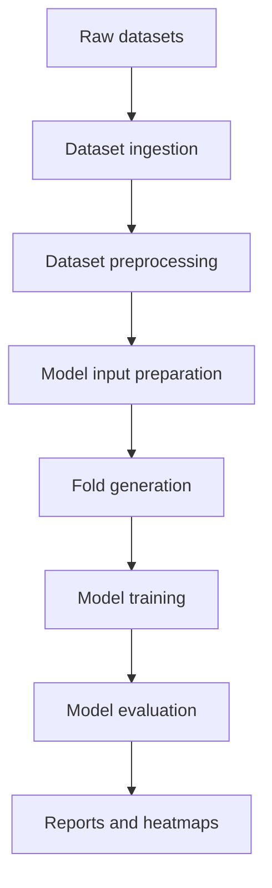
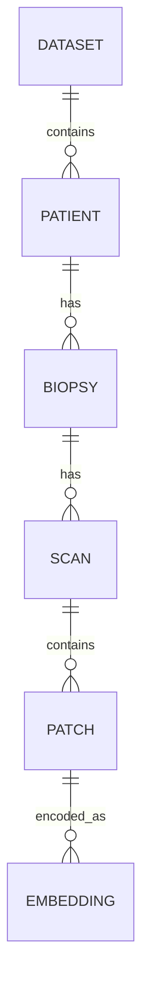
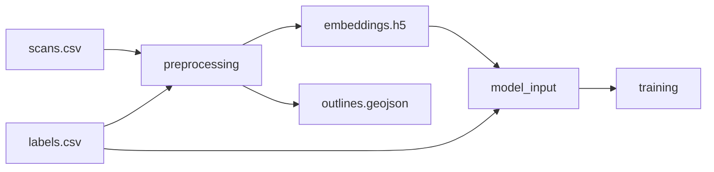

I would write this as **version-controlled Markdown in the same repo as the code**, with schemas/configs next to it. That makes it easy for both you and a coding agent to edit, validate, and turn the spec into implementation tasks.

## Recommended setup

Use this structure:

```text
repo/
  docs/
    design/
      index.md
      01-overview.md
      02-glossary.md
      03-data-model.md
      04-directory-structure.md
      05-artifact-contracts.md
      06-preprocessing.md
      07-model-input-preparation.md
      08-training.md
      09-evaluation.md
      10-snakemake-workflows.md
      11-reproducibility.md
      12-open-questions.md

  schemas/
    dataset_manifest.schema.json
    scan_manifest.schema.json
    embedding_manifest.schema.json
    label_manifest.schema.json
    model_input.schema.json
    training_config.schema.json
    evaluation_output.schema.json

  configs/
    example_dataset.yaml
    example_preprocessing.yaml
    example_training.yaml
    example_evaluation.yaml

  examples/
    processed_dataset/
      README.md
      dataset.yaml
      manifests/
        scans.csv
        labels.csv
        embeddings.csv

  workflow/
    Snakefile
    rules/
      preprocessing.smk
      training.smk
      evaluation.smk
```

This gives you a spec that is not just prose. It becomes something the agent can implement against.

---

## Best formats to use

### Markdown for documentation

Use `.md` for the main design docs.

Good because:

```text
- easy to write
- easy to review in GitHub
- easy for coding agents to edit
- supports diagrams, tables, code blocks
- works well with MkDocs, Docusaurus, VitePress, GitHub Pages
```

Avoid writing the main spec in Word/Google Docs if your goal is to work with a coding agent. They are nice for comments, but worse for incremental implementation and diffs.

---

### YAML for human-written configs

Use YAML for things humans edit:

```yaml
dataset_id: karolinska_v1
stains:
  - HE
  - sirius_red

preprocessing:
  registration:
    method: valis
    mode: rigid
  patching:
    patch_size: 256
    stride: 256
  embedding:
    model: conch_v1
```

YAML is better than JSON for configs because it is easier to read and write.

Use it for:

```text
- dataset configs
- preprocessing configs
- training configs
- evaluation configs
- experiment configs
```

---

### CSV or Parquet for manifests

Use CSV at first for readability:

```text
manifests/
  patients.csv
  biopsies.csv
  scans.csv
  labels.csv
  embeddings.csv
  bags.csv
```

CSV is easiest to inspect and debug.

Later, if files get large, use Parquet for performance:

```text
bags.parquet
patches.parquet
predictions.parquet
```

A good compromise:

```text
- CSV for small metadata manifests
- Parquet for large tables
- HDF5/Zarr for large embeddings and attention arrays
```

---

### JSON Schema for contracts

This is very useful for coding agents.

For example, instead of only writing:

```text
scan_manifest.csv contains scan_id, patient_id, biopsy_id...
```

also create:

```text
schemas/scan_manifest.schema.json
```

The coding agent can then implement validation scripts from the schema.

Example:

```json
{
  "type": "object",
  "required": ["scan_id", "dataset_id", "patient_id", "biopsy_id", "stain", "raw_wsi_path"],
  "properties": {
    "scan_id": { "type": "string" },
    "dataset_id": { "type": "string" },
    "patient_id": { "type": "string" },
    "biopsy_id": { "type": "string" },
    "stain": { "type": "string" },
    "raw_wsi_path": { "type": "string" },
    "registered_wsi_path": { "type": ["string", "null"] },
    "outline_path": { "type": ["string", "null"] }
  }
}
```

Even if the exact schema changes later, having it forces clarity.

---

## Documentation generator

I would use **MkDocs Material**.

Why:

```text
- Markdown-based
- simple
- beautiful by default
- searchable
- easy to host
- good for technical project documentation
- works very well with Python/Snakemake projects
```

Structure:

```text
mkdocs.yml
docs/
  index.md
  design/
  workflows/
  schemas/
  examples/
```

Example `mkdocs.yml`:

```yaml
site_name: Histology MIL Pipeline

theme:
  name: material

nav:
  - Home: index.md
  - Design:
      - Overview: design/01-overview.md
      - Glossary: design/02-glossary.md
      - Data Model: design/03-data-model.md
      - Artifact Contracts: design/05-artifact-contracts.md
      - Training: design/08-training.md
      - Evaluation: design/09-evaluation.md
  - Examples:
      - Processed Dataset: examples/processed-dataset.md
  - Schemas:
      - Manifests: schemas/manifests.md
```

This gives you a nice website, while still keeping everything as plain Markdown.

---

## Diagrams

Use **Mermaid** inside Markdown.

Example:

````markdown

````

Also useful:

### Entity diagram

````markdown

````

### Pipeline dependency graph

````markdown

````

Mermaid is perfect because a coding agent can edit it directly.

---

## How to make it coding-agent friendly

The key is to write the docs as **actionable contracts**, not just explanations.

For every component, use this format:

```markdown
# Component name

## Purpose

## Inputs

## Outputs

## Config

## File layout

## Validation rules

## Error handling

## Implementation notes

## Open questions

## Acceptance criteria
```

The most important part is **acceptance criteria**.

Example:

```markdown
## Acceptance criteria

- Given a raw dataset config, the ingestion command creates `processed/{dataset_id}/dataset.yaml`.
- The generated `scans.csv` contains one row per WSI.
- Every row in `scans.csv` has `scan_id`, `patient_id`, `biopsy_id`, `stain`, and `raw_wsi_path`.
- The validation command fails if two scans share the same `scan_id`.
- The validation command fails if a referenced WSI path does not exist.
```

This is what lets a coding agent implement one piece at a time.

---

## Use ADRs for decisions

Create:

```text
docs/adr/
  0001-use-markdown-for-design-docs.md
  0002-use-yaml-for-configs.md
  0003-use-patient-level-fold-splitting.md
  0004-use-hdf5-for-embeddings.md
```

ADR = Architecture Decision Record.

Template:

```markdown
# ADR 0001: Use Markdown for design documentation

## Status

Accepted

## Context

We need a documentation format that is easy to version, review, and edit with a coding agent.

## Decision

We will write design documentation in Markdown under `docs/design`.

## Consequences

- Documentation can be reviewed in Git.
- Coding agents can modify it directly.
- Diagrams can be written using Mermaid.
- Rich collaborative comments are less convenient than in Google Docs.
```

This is very helpful when the project evolves.

---

## Add “implementation task” blocks

Inside each design page, include small task blocks that a coding agent can pick up.

Example:

```markdown
## Implementation tasks

- [ ] Create `schemas/scan_manifest.schema.json`.
- [ ] Implement `validate_scan_manifest(path: Path)`.
- [ ] Add CLI command `pipeline validate scans`.
- [ ] Add unit tests for missing required columns.
- [ ] Add example `scans.csv`.
```

This lets you say to the coding agent:

```text
Implement the tasks in docs/design/05-artifact-contracts.md, but do not change the public schema without updating the docs and tests.
```

That is much better than asking it to “implement the pipeline”.

---

## Keep docs and code close together

For each module, you can have:

```text
src/histopipe/preprocessing/
  __init__.py
  register.py
  outlines.py
  patches.py
  embeddings.py
  README.md
```

But the main design should stay in `docs/design`.

Use local READMEs for implementation notes.

---

## Recommended authoring workflow

I would work like this:

```text
1. Write the high-level docs manually with AI help.
2. Ask the coding agent to create the repo structure.
3. Ask it to create schemas from the docs.
4. Ask it to create fake/example datasets.
5. Ask it to implement validation scripts.
6. Ask it to implement pipeline stages one by one.
7. Require every implementation PR to update docs, examples, and tests.
```

Start with docs and validation before heavy ML code.

A very good first coding-agent task would be:

```text
Create the initial documentation and schema structure for this project. Use Markdown for design docs, YAML for example configs, JSON Schema for manifest contracts, and CSV examples for manifests. Do not implement preprocessing or model training yet. Add validation acceptance criteria and TODO task lists to each design document.
```

---

## Prompt to give your coding agent

You can use something like this:

```text
We are building a histology MIL pipeline for raw WSI datasets, preprocessing, embedding generation, model input preparation, training, evaluation, aggregation, and heatmap generation.

Please create an initial documentation-first project structure.

Requirements:
- Use Markdown under docs/design for the design specification.
- Use Mermaid diagrams for the system overview and data model.
- Use YAML for example dataset, preprocessing, training, and evaluation configs.
- Use JSON Schema under schemas/ for manifest and config contracts.
- Use example CSV files under examples/processed_dataset/manifests.
- Include acceptance criteria and implementation task checklists in each design document.
- Do not implement the actual ML or preprocessing pipeline yet.
- Focus on making the contracts clear enough that implementation can follow later.

Create:
- docs/design/index.md
- docs/design/01-overview.md
- docs/design/02-glossary.md
- docs/design/03-data-model.md
- docs/design/04-directory-structure.md
- docs/design/05-artifact-contracts.md
- docs/design/06-preprocessing.md
- docs/design/07-model-input-preparation.md
- docs/design/08-training.md
- docs/design/09-evaluation.md
- docs/design/10-snakemake-workflows.md
- docs/design/11-reproducibility.md
- docs/design/12-open-questions.md
- docs/adr/0001-documentation-format.md
- schemas/scan_manifest.schema.json
- schemas/embedding_manifest.schema.json
- schemas/label_manifest.schema.json
- configs/example_dataset.yaml
- configs/example_preprocessing.yaml
- configs/example_training.yaml
- configs/example_evaluation.yaml
- examples/processed_dataset/README.md
- examples/processed_dataset/manifests/scans.csv
- examples/processed_dataset/manifests/labels.csv
- examples/processed_dataset/manifests/embeddings.csv

After creating the files, summarize:
1. What contracts were defined.
2. Which open questions remain.
3. What the next implementation step should be.
```

---

## My strongest recommendation

Use this stack:

```text
Documentation: Markdown
Documentation site: MkDocs Material
Diagrams: Mermaid
Human configs: YAML
Validation contracts: JSON Schema
Small manifests: CSV
Large tables: Parquet
Embeddings/attention: HDF5 or Zarr
Workflow: Snakemake
Version control: Git
Task tracking: GitHub Issues or Markdown checklists
```

And organize the spec around **artifact contracts**. That will make the coding agent much more useful, because it can implement against concrete files, schemas, and acceptance criteria rather than vague pipeline descriptions.


You already have the right raw material, but it is currently mixed across **data model**, **pipeline steps**, **training API**, **evaluation output**, and **workflow orchestration**. A good design spec should separate those concerns and make it clear what is stable architecture versus implementation detail.

## 1. Suggested top-level framing

I would structure the project around this conceptual flow:

```text
Raw datasets
   ↓
Dataset ingestion / normalization
   ↓
Dataset preprocessing
   ↓
Model input preparation
   ↓
Model training
   ↓
Model evaluation / inference
   ↓
Aggregation, reporting, heatmaps
```

The biggest improvement is to define **artifacts between stages**. Each stage should have:

```text
Input artifacts
Output artifacts
Metadata produced
Invariants / guarantees
Implementation notes
Open questions
```

For example:

```text
Dataset preprocessing
Input:
- Raw scans
- Registration data, if available
- Labels, if available
- Patient/biopsy metadata

Output:
- Registered WSI references
- Tissue outlines as GeoJSON/JSON
- Patch coordinate files
- Embedding files
- Combined labels table
- Dataset manifest

Guarantees:
- Every scan has a stable scan_id
- Every biopsy has a stable biopsy_id
- Every embedding file can be traced back to scan, stain, patch model, and embedding model
```

That makes the spec much easier to reason about.

---

## 2. Use multiple documentation levels

You probably want **three levels** of documentation.

### Level 1: System overview

Audience: supervisor, collaborators, future you.

Focus on what the system does, not exact implementation.

Example sections:

```text
Goal
Scope
High-level pipeline
Data sources
Main artifacts
Training/evaluation workflow
Expected outputs
Known limitations
```

This level should explain the entire project in maybe 2–4 pages.

---

### Level 2: Architecture/design spec

Audience: developers working on the pipeline.

This is where most of your current notes belong.

Example sections:

```text
Data model
Directory structure
Naming conventions
Pipeline stages
Artifact contracts
Metadata schema
Model training interface
Model evaluation interface
Snakemake workflow structure
Reproducibility strategy
Error handling
```

This should define what each part receives and produces.

---

### Level 3: Technical implementation docs

Audience: someone modifying the code.

This can be split into separate docs, for example:

```text
docs/
  overview.md
  data-model.md
  directory-structure.md
  preprocessing.md
  model-input-preparation.md
  training.md
  evaluation.md
  snakemake-workflows.md
  heatmaps.md
  metadata-schema.md
```

At this level you can describe exact CLI commands, config files, Snakemake rules, HDF5 layout, CSV schemas, and Python function signatures.

---

## 3. Improve terminology

Some of your concepts need clearer names. I would standardize these early.

For example:

| Current idea                              | Suggested term                       |
| ----------------------------------------- | ------------------------------------ |
| “Datasets helt råa som vi får dem”        | Raw dataset                          |
| “pre training andra dataset”              | Pretraining dataset                  |
| “evaluation externa set”                  | External evaluation dataset          |
| “registration data”                       | Registration artifacts               |
| “raw scans”                               | Raw whole-slide images / raw WSI     |
| “score/labels”                            | Label table / target table           |
| “key mellan scan, patienter och biopsier” | Entity mapping table                 |
| “bag naming info”                         | Bag identifier schema                |
| “model input preparation”                 | Training/evaluation dataset assembly |
| “snakemake model pipeline”                | Experiment orchestration workflow    |

Also decide whether your core unit is:

```text
patient
biopsy
scan
stain
patch
embedding
bag
```

Those need stable definitions. For example:

```text
Patient: a biological individual.
Biopsy: a tissue sample from a patient.
Scan: a digitized WSI from one biopsy and one stain.
Patch: an image crop extracted from a scan.
Embedding: feature vector generated from a patch by an embedding model.
Bag: a collection of patch embeddings used as one model input instance.
```

This is extremely important for MIL-style pipelines, because ambiguity between **scan-level**, **biopsy-level**, and **patient-level** labels causes bugs later.

---

## 4. Add an explicit data model

Your spec should have a section like this:

```text
Entity hierarchy

Dataset
└── Patient
    └── Biopsy
        └── Scan
            └── Stain
                └── Patch
                    └── Embedding
```

But you should decide whether `stain` belongs under `scan` or whether a scan already implies one stain.

A possible identifier scheme:

```text
dataset_id
patient_id
biopsy_id
scan_id
stain
registration_id
patch_model_id
embedding_model_id
bag_id
```

Then define the bag name:

```text
bag_id = {dataset_id}__p{patient_id}__b{biopsy_id}__s{stain}__patch-{patch_model_id}__emb-{embedding_model_id}
```

For example:

```text
karolinska_v1__p00042__b0003__sHE__patch-rigid256__emb-conch_v1
```

Avoid putting too much implicit meaning in filenames only. Also store the same information in a manifest file.

---

## 5. Add manifest files

This is probably one of the most important improvements.

Each dataset/stage should produce a manifest, for example:

```text
dataset_manifest.csv
scan_manifest.csv
biopsy_manifest.csv
embedding_manifest.csv
label_manifest.csv
```

Or one normalized metadata database/table.

Example `scan_manifest.csv`:

```text
scan_id, dataset_id, patient_id, biopsy_id, stain, raw_wsi_path, registered_wsi_path, outline_path, mpp, width, height
```

Example `embedding_manifest.csv`:

```text
embedding_id, scan_id, patch_model_id, embedding_model_id, embedding_path, patch_coordinates_path, n_patches, embedding_dim
```

Example `label_manifest.csv`:

```text
biopsy_id, label_name, label_value, label_type, source_dataset, available_for_training, available_for_evaluation
```

This will make your pipeline much more robust than relying on directory structure alone.

---

## 6. Separate dataset preparation from experiment preparation

Right now your notes mix preprocessing and training preparation. I would separate them strongly.

### Dataset preprocessing

This is dataset-specific and expensive.

It should do things like:

```text
- Normalize raw data layout
- Register stains
- Detect tissue outlines
- Generate patches
- Compute embeddings
- Combine labels
- Produce manifests
```

### Model input preparation

This is experiment-specific and cheaper.

It should do things like:

```text
- Select datasets
- Select stains
- Select labels
- Select embedding model
- Select patch model
- Filter biopsies/scans
- Symlink/copy embeddings
- Generate folds
- Produce train/eval-ready metadata
```

That way, you can preprocess once and create many training/evaluation datasets from the same processed artifacts.

---

## 7. Define artifact contracts

For every stage, define the expected files.

Example:

```text
processed_dataset/
  dataset.yaml
  manifests/
    patients.csv
    biopsies.csv
    scans.csv
    labels.csv
    embeddings.csv
  outlines/
    {scan_id}.geojson
  registrations/
    {registration_id}/
      transform.json
      metrics.json
  patches/
    {patch_model_id}/
      {scan_id}.parquet
  embeddings/
    {embedding_model_id}/
      {scan_id}.h5
```

Then:

```text
model_input/
  input.yaml
  manifests/
    bags.csv
    labels.csv
    folds.csv
    scans.csv
    embeddings.csv
  embeddings/
    {bag_id}.h5 -> symlink to processed dataset embedding
  outlines/
    {scan_id}.geojson -> symlink
```

And for training:

```text
training_run/
  config.yaml
  folds.csv
  checkpoints/
    fold_0.ckpt
    fold_1.ckpt
  metrics/
    train_history.csv
    validation_history.csv
    test_metrics.csv
  logs/
    training.log
  plots/
    loss.png
    mae.png
    spearman.png
```

For evaluation:

```text
evaluation_run/
  config.yaml
  predictions/
    biopsy_predictions.parquet
    scan_predictions.parquet
  attention/
    {biopsy_id}.h5
  heatmaps/
    {biopsy_id}_{stain}.png
  reports/
    evaluation_report.html
```

---

## 8. Make reproducibility explicit

Add a section called **Reproducibility and provenance**.

Include:

```text
- Dataset version
- Raw data checksum
- Preprocessing config hash
- Patch model version
- Embedding model version
- Git commit
- Conda/Docker image version
- Random seeds
- Fold seed
- Training seed
- HPO seed
```

For each model run, you should be able to answer:

```text
Which raw scans were used?
Which labels were used?
Which fold split was used?
Which embeddings were used?
Which code version created the model?
Which checkpoint produced this prediction?
```

This is especially important because you have multiple datasets, stains, registrations, embedding models, and evaluation sets.

---

## 9. Improve the training/evaluation API

Your current training function is good, but I would specify it more formally.

Example:

```python
train_model(
    model_input_path: Path,
    folds_csv: Path,
    model_config: Path,
    training_config: Path,
    run_name: str,
    output_dir: Path,
) -> TrainingRunResult
```

Where `model_config.yaml` contains:

```yaml
architecture:
  name: attention_mil
  size: medium
  hidden_dim: 512
  dropout: 0.25
  attention_dropout: 0.1

task:
  type: regression
  target: fibrosis_score

embedding:
  model: conch
  dim: 768
```

And `training_config.yaml` contains:

```yaml
seed: 123
batch_size: 1
epochs: 100
learning_rate: 0.0001
optimizer: adamw
loss: huber
early_stopping:
  monitor: val_spearman
  patience: 20
```

Training output should include both machine-readable and human-readable files.

```text
Machine-readable:
- metrics.csv
- config.yaml
- predictions.parquet
- folds.csv

Human-readable:
- plots
- report.html
- logs
```

---

## 10. Evaluation output should be normalized

You wrote:

```text
Output per biopsy per model all information needed
```

That is good, but I would separate **prediction-level**, **attention-level**, and **metadata-level** outputs.

Example `biopsy_predictions.parquet`:

```text
evaluation_id
model_id
checkpoint_id
dataset_id
patient_id
biopsy_id
scan_id
stain
true_label
prediction
quartile
fold
patch_model_id
embedding_model_id
registration_id
outline_id
n_patches
```

Example `attention.h5` per biopsy/scan:

```text
/patches/coords
/patches/attention_raw
/patches/attention_sigmoid
/patches/attention_rank
/patches/prediction_contribution
/metadata
```

This prevents one huge messy file from becoming impossible to use later.

---

## 11. Add validation checks

A design spec should say how you detect invalid data.

Examples:

```text
Dataset validation:
- Every scan has patient_id and biopsy_id.
- Every training sample has a label.
- No patient appears in both train and test folds.
- Embedding dimension matches model config.
- Patch coordinates match the WSI dimensions.
- Tissue outline exists for every scan requiring heatmap generation.
- Stain names are normalized.
- Registration metadata exists when using registered coordinates.
```

Especially important:

```text
No leakage across patient, biopsy, or dataset splits.
```

You should explicitly define whether folds are split by:

```text
patient-level
biopsy-level
scan-level
dataset-level
```

For medical data, patient-level splitting is usually the safest default.

---

## 12. Suggested design spec template

Here is a reusable draft structure you could use.

# Design Specification: Histology Dataset Processing, Training, and Evaluation Pipeline

## 1. Purpose

This document describes the design of a pipeline for preparing histology datasets, generating patch embeddings, training models, evaluating trained models, and producing reports and heatmaps. The goal is to support reproducible training and evaluation across multiple datasets, stains, registration methods, patching strategies, embedding models, and label sources.

## 2. Scope

The pipeline supports:

* Raw whole-slide image datasets.
* Datasets with labels and datasets without labels.
* Pretraining datasets where only embeddings may be required.
* External evaluation datasets with different image sources, stains, or label schemas.
* Registration artifacts and tissue outlines.
* Patch generation and embedding extraction.
* Model input assembly for training and evaluation.
* Model training, hyperparameter optimization, inference, aggregation, and reporting.

Out of scope for the first version:

* Manual annotation tools.
* Interactive web-based model inspection.
* Automatic correction of incorrect metadata.
* Long-term storage infrastructure beyond the defined directory and manifest structure.

## 3. High-Level Pipeline

The system consists of the following stages:

1. Raw dataset ingestion.
2. Dataset normalization.
3. Dataset preprocessing.
4. Model input preparation.
5. Fold generation.
6. Model training.
7. Model evaluation.
8. Result aggregation.
9. Report and heatmap generation.

Each stage produces explicit artifacts that can be validated, reused, and traced back to the original data.

## 4. Core Entities

The pipeline uses the following core entities:

* Dataset: A collection of patients, biopsies, scans, labels, and metadata from one source.
* Patient: A biological individual.
* Biopsy: A tissue sample associated with one patient.
* Scan: A digitized whole-slide image associated with one biopsy and one stain.
* Stain: The staining method used for a scan, for example H&E.
* Patch: A crop extracted from a scan.
* Embedding: A feature vector generated from a patch by an embedding model.
* Bag: The set of patch embeddings used as one model input instance.
* Label: A target value associated with a patient, biopsy, scan, or patch.
* Model run: A complete training run with a fixed input dataset, fold split, architecture, hyperparameters, and seed.
* Evaluation run: A complete inference run using one or more trained model checkpoints.

## 5. Dataset Ingestion

Raw datasets are stored as received from the original source. The raw directory should not be modified by downstream processing.

Input artifacts may include:

* Raw WSI files.
* Registration data.
* Label files.
* Patient metadata.
* Biopsy metadata.
* Scan metadata.
* External evaluation labels.

The ingestion stage creates a normalized representation of the dataset while preserving a mapping back to the original files.

## 6. Dataset Preprocessing

Dataset preprocessing produces reusable artifacts that are independent of a specific model training run.

The preprocessing stage may include:

* Combining and normalizing label files.
* Creating patient, biopsy, and scan mapping tables.
* Registering images.
* Detecting tissue outlines.
* Generating patch coordinates.
* Computing patch-level embeddings.
* Computing dataset-level metrics such as average, minimum, and maximum values.
* Producing manifests for all generated artifacts.

Outputs include:

* Normalized metadata manifests.
* Registration artifacts.
* Tissue outlines in JSON or GeoJSON format.
* Patch coordinate files.
* Embedding files.
* Combined label files.

## 7. Model Input Preparation

Model input preparation creates a self-contained input directory for a specific training or evaluation task. This directory should include or symlink all files needed by the model.

Inputs:

* One or more processed datasets.
* Label selection.
* Stain selection.
* Patch model selection.
* Embedding model selection.
* Inclusion and exclusion criteria.
* Optional external evaluation dataset configuration.

Outputs:

* Bag manifest.
* Label manifest.
* Scan and biopsy mapping files.
* Symlinks to embeddings.
* Symlinks to outlines.
* Metadata describing the selected patch model, embedding model, stains, and labels.

## 8. Fold Generation

Folds are generated from a fold seed and a specified split level.

Supported split levels:

* Patient-level split.
* Biopsy-level split.
* Dataset-level split.
* External evaluation-only split.

The default should be patient-level splitting to reduce leakage risk.

Outputs:

* `folds.csv`
* Fold generation configuration.
* Summary statistics for each fold.

Validation checks:

* No patient leakage between train, validation, and test splits.
* Balanced label distributions where possible.
* All training samples have valid labels.
* All referenced bags exist.

## 9. Model Training

The model training function receives a prepared model input directory, fold definitions, model configuration, training configuration, and output path.

Inputs:

* Path to model input preparation directory.
* Folds CSV.
* Model seed.
* Training hyperparameters.
* Architecture configuration.
* Training run name.
* Output directory.

Outputs:

* Model checkpoint per fold.
* Training history.
* Validation history.
* Test performance.
* Fold definitions used.
* Training logs.
* Training configuration.
* Model configuration.
* Plots for train, validation, and test metrics.

Tracked metrics include:

* MAE.
* Spearman correlation.
* R².
* Huber loss.
* Training loss.
* Validation loss.

## 10. Model Evaluation

Model evaluation runs inference using trained model checkpoints on a prepared evaluation input directory.

Inputs:

* Path to model input preparation directory.
* Path to trained model run.
* Evaluation tag.
* Model checkpoints.
* Fold definitions.
* Architecture and parameter configuration.

Outputs:

* Prediction per biopsy.
* Prediction per scan, if applicable.
* True labels, where available.
* Attention values per patch.
* Attention rank per patch.
* Attention sigmoid per patch.
* Metadata for stains, patch size, model, embedding model, patient, biopsy, scan, registration, and tissue outline.
* Evaluation reports.
* Heatmap inputs.

## 11. Result Aggregation

Aggregation combines model outputs across folds, checkpoints, datasets, and evaluation runs.

Aggregation outputs may include:

* Per-biopsy prediction table.
* Per-model performance table.
* Per-dataset performance table.
* Train, validation, and test metric plots.
* Loss plots.
* Comparison reports.
* HPO summaries.

## 12. Heatmap Generation

Heatmap generation uses patch-level attention or prediction contribution values together with WSI coordinates and tissue outlines.

Inputs:

* WSI file.
* Patch coordinates.
* Attention values.
* Tissue outline.
* Registration metadata.
* Evaluation metadata.

Outputs:

* Heatmap image.
* Optional interactive visualization.
* Heatmap metadata.
* Link to the model, checkpoint, and evaluation run that produced the heatmap.

## 13. Reproducibility and Provenance

Every generated artifact should be traceable to:

* Raw dataset version.
* Raw file path and checksum.
* Preprocessing configuration.
* Patch model.
* Embedding model.
* Registration method.
* Tissue outline method.
* Fold seed.
* Model seed.
* Hyperparameters.
* Model architecture.
* Git commit.
* Software environment.
* Docker or Conda environment version.

## 14. Validation and Error Handling

The pipeline should validate all manifests and stage outputs.

Required checks include:

* Every scan maps to a patient and biopsy.
* Every embedding maps to a scan.
* Every training bag has a label.
* No patient leakage exists across folds.
* Embedding dimensions match the selected model.
* Required tissue outlines exist for heatmap generation.
* Registration metadata exists when using registered coordinates.
* Stain names are normalized.
* All symlink targets exist.

## 15. Open Questions

* Should labels be defined at patient, biopsy, scan, or patch level?
* Should the primary training unit be biopsy-level or scan-level?
* How should multiple stains for the same biopsy be combined?
* How should missing labels be handled?
* Which registration method should be the default?
* Which file format should be used for large attention outputs?
* Should external evaluation datasets use the same preprocessing pipeline as training datasets?
* How should HPO results be stored and compared?

---

## 13. Specific improvements to your current plan

I would add these concepts:

### Dataset versioning

Use explicit dataset versions:

```text
dataset_id = karolinska_fibrosis_v1
dataset_version = 2026-06-10
```

Never just call something `dataset1` or `latest`.

---

### Config-first execution

Avoid hardcoding pipeline choices. Use YAML configs:

```text
configs/
  datasets/
    karolinska_v1.yaml
  preprocessing/
    rigid_registration_conch.yaml
  experiments/
    fibrosis_attention_mil_medium.yaml
```

This makes Snakemake much cleaner.

---

### Stable IDs over filenames

Filenames can change. Internal IDs should not.

Use:

```text
patient_id
biopsy_id
scan_id
embedding_id
bag_id
model_run_id
evaluation_run_id
```

---

### Clear distinction between raw, processed, and experiment data

Recommended directory split:

```text
data/
  raw/
  processed/
  model_inputs/
runs/
  training/
  evaluation/
reports/
```

Do not mix raw data and model outputs.

---

### Machine-readable metadata everywhere

Every important directory should contain something like:

```text
metadata.yaml
manifest.csv
```

This makes debugging and automation much easier.

---

### Think in “contracts”

A good design spec should not only say:

```text
This step generates embeddings.
```

It should say:

```text
This step generates one HDF5 file per scan. Each file contains patch coordinates, embeddings, patch size, embedding model name, and scan_id. The embedding dimension must match the embedding model metadata.
```

That is much more useful.

---

## 14. A good final document structure

A polished design document could look like this:

```text
1. Introduction
2. Goals and non-goals
3. Glossary
4. System overview
5. Data model
6. Directory structure
7. Identifier and naming conventions
8. Dataset ingestion
9. Dataset preprocessing
10. Model input preparation
11. Fold generation
12. Model training
13. Model evaluation
14. Aggregation and reporting
15. Heatmap generation
16. Reproducibility and provenance
17. Validation and error handling
18. Configuration files
19. Snakemake workflow design
20. Open questions
21. Implementation roadmap
```

---

## 15. Suggested implementation roadmap

I would not start with model training. I would start with the data contracts.

A good order:

```text
1. Define entity model and IDs.
2. Define directory structure.
3. Define manifests.
4. Implement raw dataset ingestion.
5. Implement preprocessing output structure.
6. Implement model input preparation using symlinks.
7. Implement fold generation and leakage checks.
8. Implement training function.
9. Implement evaluation output schema.
10. Implement aggregation and reports.
11. Implement heatmap generation.
12. Add HPO orchestration.
```

The most important first milestone is:

```text
Given raw data, produce a validated processed_dataset directory with manifests.
```

After that, training and evaluation become much easier.
